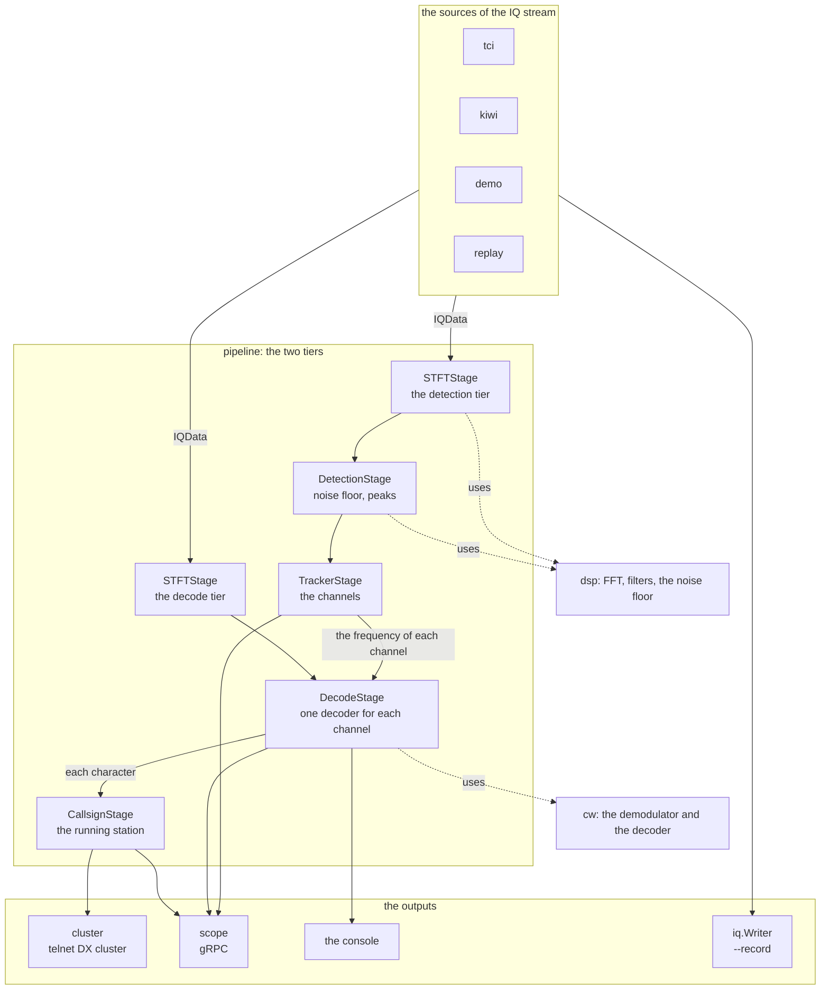

# The Architecture of SDRainer

This document describes the whole application: what it does, how a user speaks
to it, which parts it has, and why each part works as it does. It also holds the
ways that we tried and did not keep, with the measurement that decided each one.

The document is complete in itself. It points to no other document.

## 1. What SDRainer does

SDRainer is a **CW skimmer**. It listens to a wide part of an amateur radio
band at one time, it finds each station that sends Morse code in that part, it
decodes the text of each of them at the same time, and it reports the callsign
of each station that calls CQ.

An operator in a contest wants to know which stations call CQ, and on which
frequency. A skimmer gives that list without a human at the receiver. SDRainer
is the free equivalent of the programs that do this on other systems.

### 1.1 The way of the data

```
an SDR gives IQ samples
        │
        ▼
 find each signal in the band          (the detection tier, one time)
        │
        ▼
 follow each signal over the time      (the tracker)
        │
        ▼
 decode the text of each signal        (the decode tier, one time for each channel)
        │
        ▼
 find the callsign of the station that calls CQ
        │
        ▼
 report it as a spot
```

### 1.2 What SDRainer is not

- It is **not a receiver for a human ear**. It writes text, and it makes no
  audio for a loudspeaker.
- It decodes **only CW**. It does not decode RTTY, PSK or another mode.
- It takes the IQ stream over a network. It reads no sound card and no USB
  device.

### 1.3 The state of the work

The application works and it finds stations on a real band. The quality of the
copy is not yet the quality of a good operator: a measurement against 5
transcribed signals of a real recording gives a character error rate of 0.19 to
0.62. Section 12 holds those values and the reason for each of them.

## 2. The interfaces to the outside

### 2.1 The command line

SDRainer is a headless program. It takes each value from the command line, it
writes its log to the console, and it needs no configuration file.

```
sdrainer <command> [flags]
```

| Command | What it does |
|---|---|
| `tci` | takes the IQ stream of a TCI device and decodes it |
| `kiwi` | takes the IQ stream of a KiwiSDR and decodes it |
| `hpsdr` | takes the IQ streams of an openHPSDR device and decodes them |
| `demo` | makes an IQ stream of 6 signals itself and decodes it |
| `replay` | takes a recorded IQ stream from a file and decodes it |
| `listen` | makes an audio file of one signal of a recorded IQ stream |
| `prepare` | makes the audio files and the empty transcriptions of a whole recording |
| `version` | writes the version |

**The flags of each command**, so the flags of the root command:

| Flag | What it does | Default |
|---|---|---|
| `--cluster` | start the telnet server of the DX cluster | off |
| `--cluster-address` | the address and the port of that server | `:7373` |
| `--cluster-call` | the callsign that stands on each spot | `local-#` |
| `--spot-every` | the time after which a callsign gives a spot again | 1 min |
| `--service` | start the gRPC server | off |
| `--service-address` | the address and the port of that server | `:35369` |
| `--scope` | give the spectral frames to the gRPC server | off |
| `--record` | write the IQ stream into this file | — |
| `--debug` | write the log to the console (hidden) | off |
| `--pprof` | start pprof (hidden) | off |

**The flags of `tci`:** `--host` (default `localhost:40001`), `--trx` (the index
of the receiver), `--all-trx` (one pipeline for each receiver of the device, and
`--trx` then has no effect), `--threshold` (the level above the noise floor that
makes a peak, in dB, default 10), `--show-spots` (put each callsign on the
panorama of the TCI device), `--trace-tci` (hidden).

**The flags of `kiwi`:** `--host` (default `localhost:8073`), `--username`,
`--password`, `--center` (the center frequency), `--threshold`.

**The flags of `hpsdr`:** `--host` (the address of the device, empty looks for
one on the local network), `--center` (one frequency for each receiver, separated
by a comma), `--sample-rate` (48000, 96000 or 192000), `--threshold`.

**The flags of `demo`:** `--center`, `--noise`.

**The flags of `replay`:** `--iq-filename`, `--iq-sample-rate` (default 12000),
`--center` (0 gives each frequency as an offset), `--threshold`, `--realtime`.

**The flags of `listen`:** `--iq-filename`, `--iq-sample-rate`,
`--signal-offset` (the offset of the signal from the center, in Hz),
`--out-filename`, `--pitch` (the tone of the audio, default 600 Hz).

**The flags of `prepare`:** `--iq-filename`, `--iq-sample-rate`.

> **Decision: no configuration file.** Each value comes from a flag. A
> skimmer runs as a service with one set of values, and a flag is sufficient for
> that. A file would need a format, a reader and a rule for the order of the two
> sources.

### 2.2 The telnet server of the DX cluster

With `--cluster` the program opens a telnet server. A logging program connects
to it and it reads the spots in the format of a DX cluster:

```
DX de local-#:   14023.1  EN35UKR      CW 24 WPM 25 dB                1042z
```

The server asks each new connection for a callsign, and it then sends each spot
to it. A callsign gives a spot again only after `--spot-every`, so that one
station on one frequency does not fill the list.

**A new connection first gets the stations that are there now.** The server holds
the last spot of each station that still has a channel, and it sends that list
after the connection gave its callsign, the lowest frequency first. Without it a
client that connects sees an empty band until the next station starts.

A list of the spots of the last minutes cannot do that work: the pipeline reports
the callsign of a running station one time, and again only when it finds a better
one, so a station that runs for one hour made its spot one hour ago. Those are
exactly the stations that a new connection needs.

**A station leaves that list when its channel goes away**, thus after
`DeadTimeout`. A channel that is `IDLE` keeps its spot, because an operator makes
pauses and the station is still there.

> **Decision: the format of the DX cluster and not a format of our own.** Each
> logging program already reads this format. A new format would need a change
> in each of those programs.

### 2.3 The gRPC server

With `--service` the program opens a gRPC server with two services. Both send a
stream, and a client reads it as long as it wants.

**`ChannelService`** gives the events of each channel:

| Event | What it holds |
|---|---|
| `ChannelCreated` | a new channel: its id, frequency, SNR and state |
| `ChannelStateChanged` | the channel with its new state |
| `ChannelCharacterReceived` | the channel, one character, and the offset of that character in the stream of IQ samples |
| | the character is a letter, a digit, a space, `\n` for the end of an over, or U+FFFD for a character that the decoder could not read |
| `ChannelRunningCallsignDetected` | the channel with the callsign of the running station |
| `ChannelQualityChanged` | the channel whose quality tag changed |
| `ChannelDestroyed` | the channel that goes away |

**`ScopeService`** gives the spectral frames and the time frames of the inner
work: the spectrum, the noise floor, the level of the detector and the keying of
a demodulator. It needs `--scope`, because each frame is a message with one
value for each bin, and that makes a load that a normal run does not need.

> **Decision: a stream of events and not a query.** A consumer of a skimmer
> wants each character at the moment it arrives. A query would give a list and
> the consumer would need to find what is new in it.

> **Decision: the position of a character in samples, and not a time.** The
> decoder gives a character at the **end** of that character, so a clock would
> show it too late. The position in the stream is exact, and it does not depend
> on the load of the machine. A consumer that wants a time calculates it from
> the position and the sample rate.

### 2.4 The markers of the TCI device

With `--show-spots` the `tci` command puts each callsign that it finds on the
panorama of the TCI device, as a spot with the name `>CALLSIGN<`. With
`--show-listeners` it also puts a marker on each channel. Both go away with the
channel.

This works only with a TCI device, because the protocol of that device holds the
commands for it.

### 2.5 The file of a recording

`--record` writes the IQ stream into a file: the samples of I and Q one after
the other, as `float32`, little endian, without a header. The `replay` command
and the `listen` command read that file.

> **Decision: no header in the file.** The commands take the sample rate as a
> flag. A wrong value gives a wrong result without a message.

## 3. The structure



**The packages**, and what each of them does:

| Package | What it holds |
|---|---|
| `main`, `cmd` | the command line, and the wiring of a source to the pipeline and to the outputs |
| `core` | the types that each part uses: `Channel`, the interfaces of the listeners, `Spotter`, `ScopeService` |
| `dsp` | the mathematics: FFT, the noise floor, a Goertzel filter, a mixer, a low-pass filter, a rolling history |
| `pipeline` | the stages of the processing, and the configuration of them |
| `pipeline/generator` | an IQ stream of CW signals that a test makes itself |
| `cw` | the demodulator of the keying and the decoder of the Morse code |
| `tci`, `kiwi`, `hpsdr` | the clients of the three SDRs |
| `multirx` | the rules of a source that runs more than one receiver |
| `demo`, `replay`, `listen`, `prepare` | the four commands that need no SDR |
| `iq` | recording of IQ streams into files: a writer and a reader |
| `cluster` | the telnet server of the DX cluster |
| `scope` | the gRPC server and its client |
| `notify` | one function that gives an event to each listener that wants it |
| `cli` | helpers for the the command line interface |

### 3.1 The two tiers

**This is the decision that gives the application its shape.** The pipeline
makes two spectral analyses of the same IQ stream at the same time:

**The two tiers take the same IQ stream at the same sample rate.** Only the
window and the hop are different. No tier resamples, and no tier moves a signal.

| | the detection tier | the decode tier |
|---|---|---|
| The window, at 48 kHz | 4096 samples | 1024 samples |
| The hop, at 48 kHz | 1024 samples | 256 samples |
| One bin | 11.72 Hz | 46.88 Hz |
| One frame | 21.33 ms | 5.33 ms |
| What it must do | separate two stations that stand near each other | follow the keying of a fast signal |

**The two sizes follow the sample rate**, so the bin width and the time of one
frame are the same at each rate that SDRainer supports:

| Sample rate | The detection tier, window / hop | The decode tier, window / hop |
|---|---|---|
| 12 kHz | 1024 / 256 | 256 / 64 |
| 24 kHz | 2048 / 512 | 512 / 128 |
| 48 kHz | 4096 / 1024 | 1024 / 256 |
| 96 kHz | 8192 / 2048 | 2048 / 512 |
| 192 kHz | 16384 / 4096 | 4096 / 1024 |

Each value is a count of samples. The **window** is the count of the samples of
one FFT, and the **hop** is the distance from one window to the next one.

Each line of that table gives 11.72 Hz for each bin of the detection tier and
46.88 Hz for each bin of the decode tier, and 21.33 ms and 5.33 ms for one
frame. The reason is section 4: the window of the detection tier comes from
`BinWidth`, the window of the decode tier comes from `MaxWPM`, and both are a
count of **seconds** that the rate then makes a count of samples.

One analysis cannot do both. A window that is long enough for a fine frequency
gives a time that is too coarse: at 21.3 ms one dit of a signal at 40 WPM is
1.4 frames, and the decoder then sees no keying. A window that is short enough
for the time gives bins of 47 Hz, and two stations that stand 50 Hz apart fall
into one bin.

**The decoder needs approximately 2.25 ticks for each dit.** A measurement of a
transmission of 231 characters gives an error rate of 0.004 down to 50 WPM,
which gives 2.3 ticks, and 0.965 at 60 WPM, which gives 1.9 ticks.

**A window that is longer than one dit is the harder limit.** The keying is then
no longer visible, whatever the count of the ticks is. The window of the
detection tier is 85.3 ms at 48 kHz, and one dit at 20 WPM is 60 ms, so that
tier alone cannot supply the decoder at a usual speed of a contest: its limit is
14 WPM.

The length of one dit in ticks, at 48 kHz:

| | Window | Hop | One tick | 20 WPM | 40 WPM | The highest speed |
|---|---|---|---|---|---|---|
| the detection tier | 4096 | 1024 | 21.3 ms | 2.8 | 1.4 | **14 WPM** |
| the decode tier | 1024 | 256 | 5.3 ms | 11.3 | 5.6 | **56 WPM** |

The decode tier does not need a fine frequency, because the tracker already
knows where each station stands. Its window of 21.3 ms gives the limit of 56
WPM, and its ticks alone would permit 100 WPM.

> **The alternative: one downconversion for each channel.** Move each signal to
> 0 Hz with a mixer, filter it, and make the envelope from the filtered signal.
> This gives a filter that stands exactly on the channel, instead of 3 bins on a
> grid of 46.88 Hz.
>
> **We built this way and we measured it, and we do not keep it.** The
> measurement of 2026-08-21 is below. It is complete, and we do not do this
> experiment again.
>
> The chain of one channel was: an NCO to 0 Hz, a FIR low-pass, the square of the
> magnitude, and the mean of 4 values for each hop. It gave one envelope value at
> the rate of the frames of the decode tier, so each part behind it stayed as it
> is and only the source of the envelope changed.
>
> **The copy got worse.** The mean of the character error rate over the 11
> transcriptions of section 12.2, for the width of the filter and for the count
> of the values that make one envelope value:
>
> | The width | 1 value | 4 values | 16 values |
> |---|---|---|---|
> | 100 Hz | 0.505 | 0.497 | **0.466** |
> | 150 Hz | 0.557 | 0.541 | 0.529 |
> | 250 Hz | 0.546 | 0.550 | 0.547 |
> | 400 Hz | 0.552 | 0.570 | 0.565 |
>
> **The two tiers give 0.437**, so each of those 12 settings is worse. The
> downconversion was better than the two tiers on 1 of the 11 transcriptions.
>
> A narrower filter is better, and more values for each envelope value are also
> better. Both point at the noise of the envelope, and not at the keying: a
> narrow filter needs more time and it would smear the keying, and it still won.
> The demodulator of section 7 finds its levels from the envelope of the two
> tiers, and those constants come from a measurement with that envelope. A
> different envelope possibly needs different constants, and we did not measure
> that.
>
> **The load got much worse.** The work for each second of audio at 48 kHz, for
> the decode tier alone:
>
> | Channels | the two tiers | the downconversion |
> |---|---|---|
> | 1 | 4.9 ms | 46.6 ms |
> | 10 | 6.9 ms | 312 ms |
> | 50 | 11.4 ms | 1508 ms |
>
> **The two lines never cross.** The downconversion is more expensive at one
> single channel already, and its cost grows with each channel while the cost of
> the STFT stays almost constant. At 192 kHz with 10 channels it needs 1168 ms
> for each second of audio, so it is slower than real time, where the two tiers
> need 21.5 ms.
>
> The FIR of that measurement uses a ring buffer with a modulo for each tap, and
> a better one is possibly 5 times faster. That does not change the answer: the
> cost for each channel at 48 kHz would still be 6 ms against 0.23 ms.
>
> The values above hold for the cheapest setting, thus 150 Hz and 4 values. The
> setting with the best copy, 100 Hz and 16 values, costs approximately 4 times
> more.
>
> **The two tiers stay.** They cost one FFT for the whole band, the cost does not
> grow with the count of the channels, and they copy better.

### 3.2 One worker for the two tiers

The two tiers give their frames to **one** goroutine. That goroutine holds each
stage, so no stage needs a lock.

```
the source (its own goroutine)
   │ IQData: the STFT of both tiers runs here
   ▼
two channels of frames (32 places each)
   │
   ▼
the worker (one goroutine): detection, tracker, decode, callsign
```

The STFT runs in the goroutine of the source, and only the frames go to the
worker. The frames of the two tiers are independent: the decode tier makes 4
frames while the detection tier makes 1, and the worker takes them in the order
in which they arrive.

> **The alternative: one goroutine for each channel**, as a pool of workers. The
> research proposed it. We did not need it: a measurement gives 87 times faster
> than real time at 12 kHz and 9 times at 192 kHz, each with one core. A pool
> would need a bounded queue for each channel, a rule for the samples that do not
> fit into it, and a mark in the text where they were.

#### The stop

`Stop` closes the two channels of the frames, and a send on a channel that is
closed panics. **A source cannot always stop its stream first:** the TCI client
and the KiwiSDR client give their samples in a goroutine of their own, and a
callback that already runs continues after the command that stops the stream.
The program therefore ended with `panic: send on closed channel` in the STFT.

A lock holds the two apart. `IQData` takes it for reading and `Stop` takes it for
writing, so `Stop` waits for each call of `IQData` that runs, and a call that
comes later finds no channels and does nothing.

**The worker takes the channels as parameters**, and it reads no field of the
pipeline for them. `Stop` sets those fields to nil, and a worker that reads them
would race with that.

**One goroutine gives the samples.** The STFT holds the samples that are left
over in a buffer of its own, so `IQData` is not safe for two callers at the same
time. The lock is a read lock because it holds `IQData` against `Stop`, and not
against a second `IQData`.

## 4. The configuration of the pipeline

`pipeline.Config` holds **13 values**, and each of them is physical: a
frequency, a time, a speed or a ratio. `Derive` calculates each size in samples
and each count in bins and in frames from them.

| Value | What it is | The usual value |
|---|---|---|
| `SampleRate` | the sample rate of the IQ stream | from the source |
| `CenterFrequency` | the center of the band | from the source |
| `BinWidth` | the smallest distance between two stations that must stay separate | 12 Hz |
| `MinWPM` | the slowest speed to decode | 8 |
| `MaxWPM` | the fastest speed to decode | 56 |
| `PeakThreshold` | the level above the noise floor that makes a peak | 10 dB |
| `MinDutyCycle`, `MaxDutyCycle` | the limits of the CW test | 0.15, 0.9 |
| `MaxAutocorrelation` | the limit of the second CW test | 0.4 |
| `NoiseFloorTime` | the time constant of the noise floor | 3 s |
| `DeadTimeout` | the time after which a silent channel goes away | 20 s |
| `MaxDrift` | how fast a signal can move | 2 Hz/s |
| `ScopeFrameRate` | the frames for each second that go to the scope | 10 |

Each other value comes from these:

```
BlockSize        = the smallest power of 2 with SampleRate/BlockSize <= BinWidth
Hop              = BlockSize / 4
DecodeBlockSize  = the largest power of 2 that is not longer than one dit at MaxWPM
DecodeHop        = DecodeBlockSize / 4
FrameInterval    = Hop / SampleRate
CWWindow         = 10 dits at MinWPM
IdleTimeout      = 1.5 x the word gap at MinWPM
ConfirmCount     = MinDutyCycle x CWWindow / FrameInterval
MinKeyingRate    = 1 / (2 dits at MinWPM)
```

**The hop is one quarter of the window.** A Hann window needs an overlap of 75 %
for a result that is smooth over the time. The hop is therefore not a free
value.

> **Decision: 13 physical values, and not 21 values of the implementation.** The
> configuration held `BlockSize`, `Hop`, `NoiseFloorSpan` and each other size
> directly. Two of them were wrong when the sample rate changed: a span of the
> noise floor in Hz gives 21 bins at 96 kHz, where the median needs 43. A value
> that a user cannot reason about does not belong in a configuration.

> **Decision: `DefaultConfig` gives each value.** Each source uses the same
> values, and only `PeakThreshold` comes from a flag. Before that, the demo, the
> kiwi command and the replay command each held their own copy of 11 constants.

### 4.1 The sample rates

The pipeline works with 12, 24, 48, 96 and 192 kHz. A test runs the scene at
each of them.

The load, with 5 channels, on one core:

| Sample rate | Block size | The whole pipeline | Faster than real time |
|---|---|---|---|
| 12 kHz | 1024 | 11.5 ms for each second | 87 x |
| 24 kHz | 2048 | 21.9 ms | 46 x |
| 48 kHz | 4096 | 39.1 ms | 26 x |
| 96 kHz | 8192 | 65.8 ms | 15 x |
| 192 kHz | 16384 | 105.4 ms | 9 x |

The load grows with the logarithm of the sample rate, and not with the width of
the band: one FFT costs `n·log(n)`, and the count of the frames for each second
stays the same.

**The threshold must grow with the band.** A wider band holds more bins, and
each bin can give a false channel. At 10 dB the scene gives no false channel up
to 48 kHz, and above it the threshold needs 12 dB.

## 5. The component: `dsp`

`dsp` holds the mathematics, and it knows nothing about CW. Each type takes a
numeric type as its parameter, so the same code works with `float32` samples and
with an integer frequency.

| Part | What it does |
|---|---|
| `FFT` | a radix-2 FFT: IQ in, spectrum and PSD out |
| `FrequencyMapping` | a bin to a frequency, and a frequency to a bin |
| `FindNoiseFloor` | a moving median over the frequency axis |
| `NoiseFloor` | the same value, smoothed over the time |
| `FindPeaks` | the groups of bins above the floor |
| `Goertzel` | one tone in an audio stream |
| `NCO` | a mixer: it moves a signal by a frequency |
| `LowPass` | a FIR filter with a windowed sinc |
| `RollingHistory` | the last n values, with the maximum, the minimum and the sum |
| `BoolDebouncer` | a state that must stay for n calls before it counts |

**The noise floor is a moving median over the frequency**, and not a mean. A
median ignores a peak inside its span. It breaks when more than one half of its
span holds signal, and one CW signal covers 3 to 10 bins: a span of 11 bins
therefore fails, and the span is 43 bins, so 500 Hz at a bin width of 11.7 Hz.

**The peak of a signal lies between two bins.** A parabola over the peak bin and
its two neighbours gives the frequency with an error below 2 Hz.

## 6. The component: `pipeline`

The pipeline holds the stages, and each stage does one thing.

### 6.1 `STFTStage`

It takes chunks of IQ samples of any length, it keeps what is left over, and it
gives one frame for each hop. A frame holds the spectrum, the noise floor, the
peaks, its number and the position of its first sample in the stream.

**A frame comes from a pool.** The consumer gives it back. A skimmer makes 47
frames for each second at 48 kHz, each with 4096 values, and a new slice for
each of them would give the garbage collector unnecessary work.

**The spectrum holds linear power**, and not dB. Each later step adds values,
and a sum is correct only in the linear domain. The conversion to dB happens
one time, for the display.

### 6.2 `DetectionStage`

It calculates the noise floor of each frame, and it finds the peaks above it.

- A bin is a candidate when it stands `PeakThreshold` above the local floor.
- Adjacent candidates make one group.
- Two groups that stand closer than 40 Hz make one station, because the keying
  sidebands of one signal are that wide.

**The threshold of 10 dB comes from a measurement**, over 30 s of the scene of
the demo:

| The threshold | False channels |
|---|---|
| 10 dB | 0 |
| 8 dB | 70 |
| 6 dB | 1283 |

### 6.3 `TrackerStage`

The tracker makes a channel of each signal that stays, and it follows that
signal over the time.

**The states of a channel:**

```
NEW ──(ConfirmCount detections and the CW test)──> CONFIRMED
 │                                                     │
 │                                        (a peak in each frame)
 │                                                     ▼
 └──(no peak, and not yet CONFIRMED)──> away        ACTIVE ⇄ IDLE ──(DeadTimeout)──> DEAD
```

- A channel becomes `CONFIRMED` after `ConfirmCount` frames with a peak, and
  only when it passes the CW test.
- It goes to `IDLE` after `IdleTimeout`, so 1.5 word gaps at `MinWPM`. An
  operator makes pauses, and a pause is not the end of a transmission.
- It goes to `DEAD` after `DeadTimeout`, and the channel then goes away.

**A channel holds an absolute frequency**, and not a bin. The center frequency
of the SDR can change while the program runs, and a channel that stays inside
the band then keeps its identity.

**The tracker follows a drift.** The frequency of a channel moves towards each
new peak, with a step that `MaxDrift` limits. The limit holds for each unit of
time, and not for each detection: a CW signal has energy in only a part of the
frames.

#### The CW test

A peak is not always CW. A carrier, a beacon, a data mode and a birdie also make
peaks. The tracker keeps one bit for each frame of the CW window: the detection
stage found a peak, or it did not. Two measures come from those bits, and a
candidate must pass both:

- **The duty cycle**, so the part of the frames with a peak. A carrier gives
  1.0. The limits are 0.15 and 0.9. The lower limit is `ConfirmCount`: a
  candidate must have that count of detections inside one CW window, and
  `ConfirmCount = MinDutyCycle × CWWindow / FrameInterval`. There is no second
  lower limit.
- **The autocorrelation**, which says how much the bits are equal to a copy of
  themselves that stands some frames later. The count of those frames has the
  name **lag**. The tracker takes the **smallest** value over the lags from 1 to
  one dit at `MinWPM`, which is 7 frames at `MinWPM` 8. One dit is one half of
  the period of the slowest keying, so a signal that switches stands against
  itself somewhere inside that range: its marks then lie at the position of its
  gaps, and the value goes towards 0 or below it. A signal that does not switch
  is equal to each copy of itself, and it stays at 1. The limit is 0.4.

Real CW of the scene gives a duty cycle of 0.70 to 0.87 and an autocorrelation
of 0.09 and below. A carrier gives 1.00 and 1.00.

**This test is the most valuable single filter of the pipeline.** Without it
each carrier and each birdie of the band becomes a channel with text.

#### The lower limit of the duty cycle

**The lower limit was 0.07, and that made the test useless against noise.** 0.07
is 4 detections of the 70 frames of one CW window at 12 kHz, and 4 peaks of the
noise inside 1.5 s are common at a threshold of 10 dB over 1024 bins. The
autocorrelation does not help there: 4 single peaks inside 70 frames have no
relation to a copy of themselves, so the value goes to 0 and the candidate
passes.

A recording of 54 s of the 20 m band shows the cost. A human listened to the WAV
file of each channel of it:

| What the human heard | Channels | The duty cycle at the confirmation |
|---|---|---|
| a CW signal | 6 | 0.40 to 0.89 |
| a signal that is not CW | 1 | 0.89 |
| nothing | 67 | 0.06 to 0.26 |

**The two groups do not overlap**, with one exception at 0.26. The limit is
therefore 0.15, and the same recording now gives 9 channels instead of 74.

The value is 0.15 and not 0.30, although 0.30 would remove one channel more. A
signal that a human transcribed in another recording was confirmed with a duty
cycle of 0.19, and the limit must stay below such a value. The measurement of the
character error rate of the 11 transcriptions:

| The lower limit | Channels of the recording | The mean error rate |
|---|---|---|
| 0.07 | 74 | 0.441 |
| **0.15** | **9** | **0.434** |
| 0.20 | 9 | 0.428 |
| 0.25 | 9 | 0.448 |
| 0.30 | 9 | 0.457 |
| 0.40 | 8 | 0.449 |

**The copy does not get worse.** A candidate that the limit rejects does not
disappear: the next peak makes a new candidate, and a station that transmits
reaches the limit in one of the next windows. A measurement shows that directly:
one strong signal was confirmed with a duty cycle of 0.06 before the change,
because its first peak stood in a pause of the station, and its transcription
gives the same error rate after the change.

> **The alternative: a higher threshold of the detection.** It also removes false
> channels, and it costs more. At 14 dB the same recording gives 10 channels, so
> one more than the limit of the duty cycle gives, and it loses each weak signal.
> It also **splits a strong signal into two channels**: at 12 dB to 16 dB the
> station at +480 Hz gives a channel at +476 Hz and one at +480 Hz, because the
> groups of its peak fall apart above the threshold. The limit of the duty cycle
> needs no such trade.

#### What is left

Two channels of that recording still hold nothing, at −3012 Hz and +4719 Hz.
Both stand approximately 2 dB above the threshold and they last long, so their
duty cycle reaches the limit.

**One signal of that recording is not CW and the test cannot see it.** It has a
duty cycle of 0.89 and a smallest autocorrelation of −0.12, and a fast CW signal
of the same recording has 0.89 and −0.14. The width of the signal does not
separate the two either: the measurement gives a mean width of 28 Hz and a
largest width of 105 Hz for the signal that is not CW, and 44 Hz and 129 Hz for
the CW signal. A test that separates them must look at the durations of the
elements, and not at the presence of a peak. Section 13 holds that.

**Two of the three channels of that signal went away with the new limit.** They
were false channels beside it, and not parts of it.

> **The alternative for the autocorrelation: a peak at the dot period.** The
> research proposed that. A peak needs the dot period, and the tracker does not
> know it: the speed comes from the decoder, and the decoder starts after the
> tracker. The smallest value over a range of lags needs no period.

#### The width of a match

A peak belongs to a channel when it stands inside a distance of that channel.
That distance is **100 Hz for a channel** and **2 bins for a candidate**.

The 100 Hz come from the decode tier: it takes the energy of 3 bins around the
frequency of a channel, and those 3 bins are 141 Hz at each sample rate. Two
channels that stand closer than that decode almost the same signal.

> **This value was 2 bins, so 23 Hz, until a measurement showed the cost.** A
> station that drifts, or that has a wide signal, gave more than one channel, and
> each of them held a part of the text: a recording of the 20 m band gave 3
> channels for one station and 2 for another. With 100 Hz the recording gives 10
> channels where it gave 14, and the text of the split stations is together.

> **A false channel beside a real signal sounds like that signal.** The recording
> of the 20 m band gave a channel at −1056 Hz and one at −1194 Hz, and a human
> heard the same station in both WAV files. That looks like a tracker that splits
> a station, and it is not: the channel at −1194 Hz was a false channel of the
> noise, and the filter of the `listen` command is 300 Hz wide, thus ±150 Hz, so
> the WAV file of a channel 138 Hz beside a station holds that station. The lower
> limit of the duty cycle removed that channel.

> **A candidate must keep the narrow width.** With 100 Hz for a candidate too,
> the keying edges of a strong station give peaks over a wide range that make
> **one** candidate together, and that candidate reaches `ConfirmCount`: the
> scene then gave a false channel 225 Hz beside a station.

#### The change of the center frequency

An operator can turn the dial of the SDR while the program runs.
`SetCenterFrequency` takes the new value from any goroutine, and the worker
applies it between two frames. A channel that is still inside the band keeps its
frequency and continues. A channel outside it gets no more peaks, so it goes
through `IDLE` to `DEAD`, as a signal that stopped.

The stage also **drops each frame that waits in the buffer**. Those frames come
from samples of the old band, and the new mapping would give their peaks a
frequency that is wrong by the shift. A candidate needs only `ConfirmCount`
frames, so 85 ms at 12 kHz, and the buffer holds up to 0.68 s: without this
rule a measurement gave 12 false channels in 8 runs, each at the frequency of a
real signal plus the shift.

### 6.4 `DecodeStage`

The decode stage holds one demodulator and one decoder for each channel. It
takes the frames of the decode tier, and it gives each decoder the energy of its
own signal.

**The envelope of a channel is the sum of 3 bins** around its frequency. The
main lobe of a Hann window is 1.5 bins wide, so 3 bins hold the whole energy of
one tone. One bin alone is not sufficient: a signal that drifts moves over a bin
border, and one bin then shows a gap in the keying that does not exist.

**Only an `ACTIVE` channel decodes.** A channel that is idle has no signal, and
its 3 bins hold only noise. The demodulator would take that noise as its two
levels and the decoder would make characters of it: a channel that went idle
gave text until it was dead, so for the whole `DeadTimeout`. The stage gives
such a channel a gap instead.

**The tick must happen even then.** The position of a character comes from the
count of the ticks of its decoder, so a tick that does not happen would move
each later character forwards in the stream.

**A channel outside the spectrum decodes nothing.** The mapping of a frequency
to a bin limits its result to the bins that exist, so a channel outside the band
would decode the noise of the first or the last bin. This happens after a change
of the center frequency, until the tracker sees the channel go idle.

**The stage follows the drift.** The tracker moves the frequency of a channel
and it reports no event for that, so the bins of an envelope would stay at the
frequency of the moment of the creation. The 3 bins hold 141 Hz, which is 70 Hz on
each side of the frequency of the creation, and a signal that drifts leaves that
window. A measurement before this rule shows the wall: a signal that drifts with
2 Hz for each second gave noise after approximately 42 s.

### 6.5 `CallsignStage`

This stage finds the callsign of the **running** station of a channel, so of
the station that calls CQ.

**A valid callsign is not sufficient.** The station that answers a call uses the
frequency of the running station, so the text of one channel holds the callsigns
of both. This is one complete QSO on one channel:

```
> cq a1bc a1bc test     the call
> cq a1bc a1bc test     the call again
< dl0xy                 the answer of DL0XY
> dl0xy 599 123         the report of A1BC for DL0XY
< r 599 001             the report of DL0XY for A1BC
> tu                    A1BC finishes
```

A rule that takes each word that is a valid callsign gives DL0XY as often as
A1BC. In a pileup it gives the wrong answer: many stations answer at the same
time and each of them repeats its own callsign, while the running station sends
its callsign one time.

**The rule uses the words around the callsign.** Only the running station puts
its callsign beside one of the words of a call:

| The word stands | The words | Example |
|---|---|---|
| keyword, before the callsign | `cq`, `test`, `qrl`, `qrl?`, `tu` | `cq a1bc` |
| keyword, after the callsign | `test` | `a1bc test` |
| filler, between the two | `de`, `dx` | `cq dx de a1bc` |

**A filler word counts nothing by itself.** It only holds the place between the
keyword and the callsign, and the search steps over it. The join of the pieces of
a callsign does not take it, exactly as it does not take a keyword.

`de` is a filler word and not a keyword, because it stands in a call as well as
in a QSO: `cq de a1bc` is a call, and `a1bc de dl0xy` means "A1BC, this is
DL0XY". The second form says nothing about which of the two stations runs, and an
operator uses it at the beginning and at the end of each over, so a `de` that
counts by itself gives the station that answers a hit with each over. A `de`
alone, at the beginning of an over, says as little. `dx` is the same case: only
`cq dx` is a call, and a `dx` in the text of a QSO, as in `tnx dx`, says nothing.

**A keyword that also closes a call needs a clean start.** `test` stands on both
sides of the callsign, so `a1bc test` and `test a1bc` are both calls. In a stream
of text the two forms meet, and an ordinary word before such a keyword says that
the keyword closes and opens nothing.

The text `1bc test dl0xy dl0xy dl0xy cq a1bc test dl0xy dl0xy dl0xy` shows why:
the decoder lost the first character of `a1bc`, so `test dl0xy` looks like a
call, and the station that answers took the spot.

**`tu` needs a call on the same channel.** A running station finishes a QSO with
`tu a1bc test`, and a station that answers thanks with the same words and gives
the frequency back. Only a channel that already gave a hit with `cq` or `test`
holds a station that runs.

**A filler word can stand between the keyword and the callsign.** `dx` is such a
word, as in `cq dx a1bc`. The search steps over it, and the join of the pieces
of a callsign does not take it, exactly as it does not take a keyword.

> **A filler word is no keyword.** Only `cq dx` is a call. A `dx` alone in the
> text of a QSO, as in `tnx dx`, says nothing about the station that runs, so a
> callsign behind it counts nothing. A word in the list of the keywords would
> count it.

**`tu` counts only before the callsign.** A running station finishes a QSO with
`dl0xy tu`, and the callsign before that `tu` belongs to the station that
answered.

**A callsign needs 2 hits.** One call gives both at the same time, as in
`cq a1bc a1bc test`: the first callsign stands after `cq` and the second one
before `test`. A pattern with one hit needs a repetition. The reason is the
decoder: it makes wrong characters, above all at the beginning of a
transmission, and a wrong word can be a valid callsign. Such a word is different
in each repetition, and the correct callsign is always the same.

**A callsign that stands more than one time behind the keyword gives the second
hit.** `cq a1bc a1bc` and `test a1bc a1bc` are complete calls with no word behind
the callsign, so the pattern of a keyword on each side never closes for them.
The repetition is the second hit, and such a call gives its spot at the moment of
the second callsign, without a second call.

A station that answers repeats its callsign too, as in `dl0xy dl0xy dl0xy`. That
text has no keyword before it, so it counts nothing.

**Two callsigns with the same count give no answer.** The stage waits for the
next hit instead of an answer that it must correct at once.

**An over ends the window of the words.** The decoder marks the end of a
transmission, and the stage then forgets the words that it holds: a keyword of a
call that ended says nothing about a callsign that comes minutes later. The hits
stay, because they hold what the station said over the whole life of the channel.

**A callsign can arrive in pieces.** The decoder writes a space between two
characters when the gap between them is wide, and an operator with a slow fist
sends such a gap inside a callsign: `om1um` then arrives as `o m 1 u m`. The
stage therefore joins the pieces, and it does that in both directions:

- **After a keyword**, as in `cq o m 1 u m`. The stage searches back over the
  pieces for the keyword, because the keyword is then not the word before the
  last piece. It joins each word after that keyword.
- **Before a keyword**, as in `o m 1 u m test`. The stage tries each start from
  the earliest one, so it takes the longest callsign that the pieces give.

Two rules hold that join away from a normal text:

- Each piece has 3 characters or less, so `dl1abc k` gives no callsign
  `DL1ABCK`.
- No piece is a keyword, so `cq o m 1 u m cq` gives no callsign `OM1UMCQ`.

**A join after a keyword grows with each piece**, and a shorter one can already
be a valid callsign: `o m 1 u` gives `OM1U` and the piece after it gives
`OM1UM`. Both would count, and the two would then hold each other back. A longer
join that begins at the same word therefore takes the hit of the shorter one
back. A join before a keyword needs no such rule, because it begins with the
longest one.

> **The word `k` is not a keyword.** A running station finishes its call with
> `k`, and that would give a second hit for each call. A station that answers
> also finishes with `k`, and `k` is one character that the decoder makes easily
> out of a wrong character. This is a decision that we can change: it trades a
> faster spot of a slow station against the risk of a spot of the wrong station.

> **This closed a real defect.** A QSO outside a contest holds
> `a1bc de dl0xy tu fer info ... btu a1bc de dl0xy k`, and each over repeats that
> form. While `de` was a keyword the answering station got a hit with each over,
> and a QSO where the running station transmits little gave the wrong callsign.
> Now neither of the two callsigns of such an over counts.

## 7. The component: `cw`

`cw` turns the energy of one channel into text. It has two parts.

### 7.1 `SpectralDemodulator`: the keying

The demodulator takes one value of the envelope for each tick, and it gives the
state of the keying: a mark or a gap.

**It finds its own levels.** The level of the marks and the level of the gaps
come from a window of 12 dits at the slowest speed, so 2.88 s. The decision
level lies between them, and a margin of 15 % holds a Schmitt trigger.

**The decision uses the amplitude, and not the power.** The window of the
spectral analysis slides over the edge of a mark, so the power follows the
square of the part of the window that the mark covers. A limit in the middle of
the power lies at a coverage of 71 %: the mark then begins 0.71 windows late and
it ends only 0.29 windows late, so each mark is too short and each gap is too
long. A limit in the middle of the amplitude moves the two edges by the same
time.

**The decision level lies at 35 % of the span, and not in the middle.** Two
measurements decided that value.

A signal that fades: the level of the marks is the maximum over the window, so
it holds the value from before a fade. With 50 % a mark that stands more than
3.7 dB below the strongest mark of the window is lost, and the signal of the
scene with a fade of 6 dB gave a character error rate of 0.353. With 35 % the
limit is 6 dB, and that signal gives 0.000.

Noise: the error rate of a transmission of 231 characters at 35 WPM.

| The fraction | 20 dB | 15 dB | 12 dB | 10 dB |
|---|---|---|---|---|
| 0.50 | 0.004 | 0.065 | 0.307 | 0.645 |
| 0.40 | 0.004 | 0.004 | 0.069 | 0.208 |
| **0.35** | 0.004 | 0.004 | 0.065 | **0.160** |
| 0.30 | 0.004 | 0.030 | 0.160 | 0.338 |
| 0.25 | 0.022 | 0.286 | 0.502 | 0.632 |

A value that is too high loses a mark that the noise makes weaker. A value that
is too low makes a mark out of a peak of the noise in a gap.

**The level of the marks goes down with 750 ms.** It follows each mark upwards
at once, and it then decays. Without that decay it holds the loudest mark of the
whole window of 2.88 s: a measurement of a real signal shows that 17 % of its
marks stand more than 6 dB below that value, and the detector loses them or it
cuts them into pieces.

The measurement of the time constant, as the mean of 10 runs of 5 transcribed
signals, as the sum of their 5 error rates:

| The time constant | The sum |
|---|---|
| off, the maximum of the window | 2.328 |
| 250 ms | 2.408 |
| 500 ms | 2.123 |
| **750 ms** | **2.049** |
| 1000 ms | 2.147 |
| 4000 ms | 2.330 |

A time constant that is too short takes the level down inside one character: 250
ms is 4 dits at 18.75 WPM.

**The demodulator waits before its first decision.** A demodulator that starts
knows neither level, so the span is 0 and each value above 0 would be a mark.
It reports a gap until the window holds one sixteenth of its values, which is
0.18 s.

**A run of the keying must be longer than 0.25 dits.** The debounce comes from
the speed and not from a time: at 18.75 WPM a dit is 64 ms and a run of 27 ms is
a piece, and at 40 WPM a dit is 30 ms and the same 27 ms is almost a dit. This
value made the copy of one signal 13 % better.

> **The alternative: a level window that follows the speed.** The window is 12
> dits at the **slowest** speed, so 45 dits at 18.75 WPM, and 12 dits of the
> own speed would hold much less of a fade. A measurement rejects it: the copy
> of 4 of 5 signals gets worse. The decoder gets its speed from this
> demodulator, so a window that is too short gives a wrong state, the wrong
> state gives a wrong speed, and the two never recover.

> **The alternative: a search of the decision level.** Another decoder does not
> estimate that level: it tries 8 levels against 10 speeds and it keeps the
> combination whose durations fit the timing of Morse best. A measurement
> rejects it here: each combination is worse than the constant of 0.35. The
> search moves the level with each window, and the estimate of the unit of the
> decoder holds 32 durations, so it never becomes quiet. The search takes 0.35
> most often, which says that the constant is right.

### 7.2 `Decoder`: the Morse code

The decoder takes the state of the keying for each tick, and it gives a
character.

**The timing of the code**, in dits: a dit is 1, a da is 3, the gap inside a
character is 1, the gap between two characters is 3, and the gap between two
words is 7. Each decision uses the middle between two of those values:

| The decision | The limit |
|---|---|
| a mark is a da | 2 dits |
| a gap ends the character | 2 dits |
| a gap ends the word | 5 dits |
| a mark is no element | 6 dits |

#### The alphabet of the decoder

The decoder gives more than the characters of the code table:

| The character | What it means |
|---|---|
| a letter, a digit, a sign | the code table of `digimodes` gives it |
| a space | a gap of 5 dits or more, thus a word break |
| `\n` | a gap of 30 dits or more, thus the end of an over |
| U+FFFD | the decoder could not read the character |

**U+FFFD and not `?`.** `?` is `..--..` and a character of the code table, so a
consumer could not tell a real `?` from a character that the decoder lost. That
was a defect and not only an ambiguity: the callsign stage uses `qrl?` as a
keyword, and a `qrl` with one lost character behind it gave exactly that word.
U+FFFD is the replacement character of Unicode, and the code table holds no rune
for it.

**`\n` and not a sign of its own.** A line break is what the text means: a
consumer that writes the text gets one line for each over, a consumer that splits
words at each whitespace needs no change, and a transcription that a human writes
holds one line for each over already.

**The limit is 30 dits.** A measurement of the recorded streams in
`cw/testdata`, with the dit of the decoder itself, gives two groups: a pause of
an operator **inside** one transmission reaches 16.1 dits, and the break
**between** two transmissions is 41.1 dits. 30 stands between the two.

The limit uses the mean of the two unit estimates and not the estimate of the
gaps. The keying detector makes the gaps shorter, so the estimate of the gaps
alone is not a real dit: with it the same gap measured 41 dits instead of 29, and
a limit in dits would mean nothing. The limits of the timing model use the
estimate of the gaps, because they are calibrated against it.

**The decoder gives the marker while the signal is off**, and it does not wait
for the next transmission: a station that stops for good gives no rising edge
again. The word break behind such a gap gives no space, because the marker is
already a break.

**The unit comes from a window of 32 durations.** The estimator takes a low
percentile of that window, so it finds the shortest class and it ignores the
longer classes.

**The marks and the gaps have their own estimator.** The detector is not
symmetric: it makes the marks longer and the gaps shorter, and the recorded
streams show a difference of up to 2:1 between the two units.

**The speed comes from the mean of the two estimates.** The decision level of
the demodulator is not in the middle of the span, so each mark is longer than
its true time by a constant and each gap is shorter by the same constant. The
mean removes that error, for each value of the decision level.

**The class of the da corrects the unit of the marks.** A mark is 1 dit or 3
dits, so the longest class of the marks is 3 times the shortest one. A larger
ratio says that the shortest class holds the pieces that the detector made of a
mark, and the longest class then gives the dit. A measurement of one signal
gives 9.1 ticks for the shortest class against a dit of 12, and the class of the
da gives 11.7.

> **The alternative: no duration below one half of the unit.** It looks like the
> same correction, and it breaks the adaptation: a signal that is faster gives
> durations that are truly shorter, and the rule takes them for pieces and drops
> them. The estimate can then never follow a speed that goes up. 5 tests of the
> speed fail with it.

> **The alternative: the bias out of each decision.** The two estimates hold the
> asymmetry of the detector, so a decision could use the duration and the unit
> without it. A measurement rejects it: the copy gets worse and 5 recorded
> streams break. The correction holds only when both estimates hold their own
> class, and with pieces in the window they do not.

> **The alternative: the classes of the gaps follow the operator.** The three
> classes begin at 1, 3 and 7 dits and they then take the mean of the durations
> of the window near them, so a wide gap of an operator moves the class of the
> character gap up. A measurement rejects it: 2 of 5 signals get better, 2 get
> worse, and the sum is 10 % worse. The rule needs a class of character gaps
> that the window holds, and a signal whose gaps are cut into pieces gives none.

> **The nearest of 1, 3 and 7 is the same rule as the limits.** The middle
> between 1 and 3 is 2, and the middle between 3 and 7 is 5, and those are the
> two limits above. A decoder of another project uses the smallest square of the
> distance, and it makes the same decision.

## 8. The components: the sources

Each source gives its samples to `Pipeline.IQData`, and the pipeline needs no
knowledge of the source. A source needs the sample rate before it can make the
pipeline, because each size comes from that rate.

### 8.1 `tci`

The TCI protocol connects to ExpertSDR, AetherSDR and Thetis. SDRainer asks for
an IQ stream of 48 kHz.

**The pipeline begins with the connection**, because the callback of the
connection is the moment at which the sample rate is certain.

**The frequency of the DDS goes to `SetCenterFrequency`.** The operator turns
the dial of the SDR, and that value can arrive before and after the connection.
The process holds the last value, and it gives each later one to the pipeline.

**The events of the pipeline draw on the panorama** of the TCI device: a callsign 
gives a spot with the name `>CALLSIGN<`. The spots are removed when their channel
destroyed.

#### One pipeline for each receiver

The package `multirx` holds the rules of a source that runs more than one
receiver, and `tci --all-trx` and `hpsdr` both use them.

A TCI device holds more than one receiver, and each of them gives its own IQ
stream on its own frequency. With `--all-trx` the command runs one pipeline for
each of them.

**The count of the receivers comes from the device.** TCI sends it before the
message that makes the client ready, and the client reports the connection only
after that message, so the count is there when the pipelines are built.

| Output | With more than one receiver |
|---|---|
| the scope | only the **first** receiver writes to it |
| the channel service | each receiver |
| the spotter, thus the DX cluster | each receiver |
| `--record` | only the **first** receiver |

**The scope shows one spectrum and one waterfall.** The frames of two receivers
in one stream give a picture that no consumer can take apart, so the other
receivers get a `NullScopeService`.

**A recording takes the stream of one receiver.** Two IQ streams in one file are
not two streams any more: the samples stand one after the other, and no consumer
can separate them.

**The id of a channel holds the number of its receiver**, as `0-1` and `1-1`.
Each pipeline counts its channels from 1, so two receivers give the same id to
two different stations, and a consumer holds a channel apart by that id. The
prefix comes only with `--all-trx`: with one receiver there is nothing to hold
apart, and the id then stays the id that each other source gives.

### 8.2 `kiwi`

A KiwiSDR gives its IQ stream over a websocket. SDRainer asks for 12 kHz, and
the KiwiSDR reports the rate that it uses.

**The passband covers the whole stream.** The command had a flag for a narrower
passband, and that flag could only remove spectrum that the stream already
holds: the KiwiSDR always sends 12 kHz. A measurement showed the cost of the
narrow passband: with 10 kHz the run gave 27 channels, of which 11 stood inside
110 Hz of the two edges of the passband, with a speed of 47 to 88 WPM and text
that is noise. With the whole 12 kHz the same run gives 12 channels and none at
an edge.

The reason is the filter of the receiver: it removes the signal **and** the
noise at the edges. The noise floor is a median over 43 bins, so 504 Hz, so a
bin in the middle of the filtered region gets a very low floor, and the skirt of
the filter then stands above the threshold.

### 8.3 `hpsdr`

A device that speaks the openHPSDR protocol 1 gives more than one receiver, and
each of them has its own frequency inside the same band of the ADC. `--center`
names one frequency for each receiver, and the command then runs one pipeline for
each of them.

**The original devices and the Hermes-Lite 2 speak the same protocol.** The
Hermes-Lite 2 adds a few values of its own, and the count of the receivers is the
only difference that matters here: it uses 4 bits where the original uses 3, and
the two agree for 8 receivers and less.

**The library [github.com/jancona/hpsdr](https://github.com/jancona/hpsdr) speaks
the protocol.** It holds the discovery, the session, the sequence numbers and the
command and control bytes, and it gives one callback for each receiver. It
transmits nothing, and SDRainer transmits nothing.

> **Decision: a library and not our own client.** The protocol is from 2013 and
> it does not move, and the library is 1250 lines that another project already
> tested against real hardware. Its licence is Apache 2.0, which an MIT project
> may use, and section 4 of that licence asks that the notice of the library goes
> with each distribution. The file NOTICE in the root of the repository holds it.

**The sample rate holds for each receiver of one device**, and it is 48, 96 or
192 kHz. The device also gives 384 kHz, and no measurement of SDRainer covers
that rate, so the command does not offer it.

**The two parts of a sample stand in the other order than their names say.** The
device gives the field that the protocol calls Q as the real part, and the
pipeline takes the real part first. The wrong order gives a spectrum that is
mirrored about the center: a station above the center then stands below it, by
the same distance, and a station **on** the center stays correct.

A measurement with a Hermes-Lite 2 on 2026-08-24, with a center of 7024 kHz:

| | The frequency | The distance to the center |
|---|---|---|
| the station, from a second receiver | 7034.5 kHz | +10.5 kHz |
| SDRainer, before the correction | 7013.5 kHz | −10.5 kHz |

The speed of the station was 22 wpm in both, because a mirror does not change
the time. The document of the openHPSDR protocol names the same thing for the
transmit direction: "The I&Q samples, relative to receive, are reversed. This is
a historical bug that goes back to the very first version of PowerSDR."

> **A test of SDRainer cannot find that order.** Each test makes its samples with
> the same assumption that the code reads them with, so it agrees with itself
> whatever the order is. Only a device, or a recording of one, says which order is
> right. The tests hold the value that the measurement gave.

**One goroutine of the library gives the samples of each receiver**, one receiver
after the other. `Pipeline.IQData` needs exactly that: it is not safe for two
callers at the same time. The other side of it is that a pipeline that waits
holds the samples of each other receiver back.

**The command sends an empty stream to the device without a pause**, one packet
for each 126 samples at 48 kHz, thus approximately 380 packets for each second.
The device needs it for two reasons:

- **Its watchdog stops the IQ stream** when no packet of the PC arrives. A
  measurement with a Hermes-Lite 2 shows it: without that stream the device sent
  its samples for approximately 10 s and then no more.
- **The command and control bytes ride in those packets**, one address with each
  packet, one after the other. The start of the device sends the sample rate, the
  count of the receivers and the frequency of the **first** receiver, and each
  further receiver gets its frequency only from this stream.

The samples of that stream are empty, because SDRainer transmits nothing. The
rate of 48 kHz holds whatever the rate of the receivers is: the microphone and
the transmitter of the protocol always run at that rate.

### 8.4 `demo`

The demo makes its own IQ stream with 6 signals: 5 CW stations of different
speed, level, fading and drift, and one carrier that must give no channel. It
gives the chunks with the timing of a real SDR, so 2048 samples each 42.7 ms.

The demo needs no SDR, so it is the way to see the program work.

### 8.5 `replay`

`replay` reads a recording and gives it to the pipeline. Without `--realtime` it
runs as fast as the machine allows: 34.8 s of a 12 kHz recording need 0.29 s,
so 120 times faster than real time.

It writes each channel that gave text at the end, the lowest frequency first.
That list is the way to find the signals of a recording that are worth a
transcription.

## 9. The components: the outputs

### 9.1 `cluster`

The telnet server holds the connections, it asks each of them for a callsign,
and it sends each spot to each of them. A spot holds the callsign, the frequency
and a comment of the form `CW 25 WPM 18 dB`.

**A callsign gives a spot again only after a silence period.** One station on
one frequency would otherwise fill the list of a logging program.

**A spot holds a quality tag.** The comment follows the form of a skimmer of
AR-Cluster 6, and the tag stands at its right end:

```
DX de local-#:   14035.0  DL1ABC       CW 25 dB 24 WPM CQ V           1651z
```

| Tag | What it says |
|---|---|
| `?` | the callsign reached minCallsignHits and no more |
| `V` | the callsign reached validCallsignHits, and no other callsign of the channel stands near it |
| `Q` | this callsign was valid before on another frequency **of the same band**, and the evidence here is still thin: the station moved, or the spot is an image |
| `B` | the callsign stands one character beside a callsign that the same channel made valid; the correct callsign follows in parentheses |

A logger that reads the tags of AR-Cluster 6, for example DXLog or N1MM+, needs
no change: it asks its cluster for them with `SET DX EXTENSION SKIMMERQUALITY`,
and SDRainer writes them always.

> **`V` does not mean here what it means in AR-Cluster 6.** There it says that
> three receivers at three places posted the same callsign on the same frequency.
> SDRainer is one receiver and it cannot say that. Here it says that one receiver
> read the same callsign beside a keyword of a call `validCallsignHits` times,
> over more than one transmission. Both are agreement over observations that do
> not depend on each other, and one is over the place while the other is over the
> time.

**The evidence of the frequency decides, and `Q` is not for ever.** A station
that stands on a new frequency with `validCallsignHits` hits is valid there,
whatever it did before: the receiver read its callsign there, again and again,
and that is what `V` says. `Q` therefore holds only while the evidence of the new
frequency is thin, thus for the first spot of that frequency.

The tag stayed at `Q` before: the answer came from the frequency of the station
before it, and not from the evidence of the frequency where it stands now. A
station that moved therefore never became valid again, because the callsign stage
gives one spot for each quality and it had already given both.

**`Q` holds inside one band and not over two bands.** A station of a
multi-operator group runs on more than one band at the same time, and that is the
normal way of such a station: it is no QSY and it is no image. The receiver
therefore holds the frequency of each valid callsign for each band, and the band
is the count of the whole MHz. No two bands of the amateur service hold the same
whole MHz.

Without the band the two frequencies gave a `Q` at each change, and neither of
them ever became valid again: a measurement with 7 MHz and 14 MHz gave `V`, `Q`,
`Q`, `Q`.

**The quality stands in `core.Channel`**, so each event of a channel carries it,
and a change of it gives the event `ChannelQualityChanged`. A consumer that shows
a list of the channels needs that event: the quality of a channel goes up while
the receiver reads the callsign again and again.

The gRPC service holds the value as a string, because protobuf has no rune, and
it is empty while a channel gave no callsign.

**A change of the quality is a new spot.** The callsign stage reports a callsign
when it finds it, and again when that callsign becomes valid, because the quality
belongs to the spot. A callsign that is already valid gives no further spot.

**`validCallsignHits` is 4, and no measurement stands behind that value yet.**
One call of a running station gives 2 hits, so 4 hits are two complete calls.
doc/spot_quality_concept.md, section 6, holds how to measure it: the recordings
in `pipeline/testdata` hold the correct callsign of each station, so a run gives
a table of the right and the wrong spots for each tag. The data of the three
recordings is too thin for that today.

**The server holds the spot of each station that still has a channel**, so that a
new connection sees the band as it is now, see section 2.2. `core.Spotter` has
two methods for that: `Spot` says that a station runs, and `RemoveSpot` says that
it is gone. The pipeline calls `RemoveSpot` when it destroys a channel that gave
a callsign.

> **Decision: a method of the spotter, and not a listener of the pipeline.** The
> spotter could take the events of a channel with `Pipeline.Notify`, and a source
> that gives the same object as its channel service and as its spotter would then
> get each event two times. A measurement showed that directly: the text of a
> test held each character two times. Two methods on one interface need no such
> rule.

> **The key of that list is the callsign, and not the frequency.** A station that
> drifts over the border of one kHz would otherwise stay in the list for ever.

### 9.2 `scope`

The gRPC server holds the two services of section 2.3. It also holds a client,
so that a test and a tool can read the streams.

**The scope needs its own flag**, because each spectral frame is a message with
one value for each bin. The pipeline sends 10 frames for each second, and not
one frame for each hop: a display needs no more, and each frame costs a message.

**A client that is too slow loses the oldest event, and not its stream.** Each
client has a buffer of its own, and the server drops the oldest event of a
buffer that is full. The scope is a view for debugging: one event that goes away
is a gap in that view, and a stream that ends is the end of the view, because the
client then sees nothing until it connects again. The server writes one message
when it drops the first event of a stream.

**The two streams have different buffers**, because their events have different
sizes and different rates:

| Stream | Buffer | Why |
|---|---|---|
| the scope | 10 events | one spectral frame holds one value for each bin, up to 16384 |
| the channels | 1000 events | each decoded character makes one event, and a band with 40 channels at 25 wpm gives approximately 100 events for each second, thus approximately 10 seconds |

**A client that goes away gives its buffer back.** The full buffer removed a
client before, and it does not any more, so the server needs the other end of
`Get` now: without it a client that disconnects stays in the list for ever, and
each event goes to a buffer that nobody reads.

**The stop of the scope holds the same rule as the stop of the pipeline**, see
section 3.2: the goroutine of the stream closes no channel that another goroutine
writes to. The pipeline gives its events in a goroutine of its own and it cannot
stop between two events, so `Put` meets `Stop`, and a send on a channel that is
closed panics. `Put` and `Get` therefore take the shutdown as well, and a call
that comes after the end waits for nothing: `Put` drops its event, and `Get`
gives a channel that is closed, so the loop of that client ends at once.

### 9.3 `iq`

`iq.Writer` writes the recording and `iq.Reader` reads it. **One hook covers
each source**, because each source gives its samples to `Pipeline.IQData`, and
the pipeline writes them there, before the STFT. The samples of a recording are
therefore exactly the samples that the pipeline sees.

**The recording stops after the first error, with one message.** A disk that is
full gives that error for each chunk, and the skimmer must continue.

### 9.4 `listen`

`listen` makes a WAV file, 16 bit, mono, of **one** signal of a recording. A
human then writes down what that signal says, and that text becomes the expected
result of a test.

The chain is a CW receiver:

```
IQ ──mix by −offset──> low-pass ±150 Hz ──mix by +pitch──> the real part ──> normalize ──> WAV
```

**The filter stands at the baseband and not at the pitch.** At the baseband the
wanted signal lies symmetric around 0 Hz, so one low-pass takes it and nothing
else. A filter around the pitch would need a band-pass with the double
complexity, and it would take the mirror of the signal with it.

**Two passes over the file give the level.** The first one finds the loudest
sample and the second one scales it to −3 dBFS. A weak signal is then still
audible and no sample clips. Two passes are possible because a file is not a
live stream.

### 9.5 `prepare`

`prepare` makes the files of a whole transcription session in one step. It gives
the recording to the pipeline, and it then makes two files for each channel that
carries a signal long enough:

```
<iq-filename>_<offset>.wav   the audio of that channel
<iq-filename>_<offset>.txt   empty, for the human
```

Both stand beside the recording, and the names are the names that section 12.2
needs, so a new transcription needs no move and no rename.

**A channel needs more than 5 s in the state `ACTIVE`.** A channel below that
time holds a few characters at most, and a human cannot transcribe it. A
recording of 54 s of the 20 m band gives 42 channels with that rule.

**A transcription file that exists already stays as it is.** It holds the work
of a human, and a second run of the command must not remove it. The WAV file is
derived data, and the command writes it again.

**The clock of the measurement is the position of the last character.** An event
of the state of a channel holds no position in the stream, and the replay runs
approximately 120 times faster than real time, so a clock of the machine gives no
usable time. The event of a character does hold a position: the index of its
first sample. The command therefore holds the largest position that it saw, and
each channel uses that one clock. Its resolution is the distance between two
characters of the whole band, and a band with more than one station gives many
characters for each second.

A recording where nothing decodes gives no clock, so each channel gets the time 0
and the command makes no file. Such a recording holds nothing to transcribe.

> **The alternative: a position in the event of the state.** That is exact, and
> it changes an interface that each consumer of the gRPC service uses. The clock
> of the characters needs no such change, and a channel without a character is
> not a candidate for a transcription anyway.

## 10. The component: `pipeline/generator`

The generator makes an IQ stream with CW signals. Each test of the pipeline uses
it, so a test needs no recording and it gives the same result in each run.

A signal holds a frequency, a text, a speed, an amplitude, a drift, a fading, a
rise time of the keying edges, and a turn.

**A turn makes a QSO.** The signal sends its text one time at the beginning of
each turn, and it is then silent until the next turn. The text always stops
after a word break, so the end of an over makes no key click.

**The rise time of the keying matters.** A measurement with 2 stations at the
full level:

| The rise time | Channels beside the stations |
|---|---|
| 0 ms | 37, over the whole band of 12 kHz |
| 5 ms | 1 |
| 20 ms | 0 |

A rise time of 0 is the worst case: the keying is a rectangle and the level of
its sidebands falls only with `1/f`. Each other test uses 5 ms.

**The count depends on the silence in a turn**, and not only on the keying
edges. The same QSO with a text that fills the turn gives no such channel, and
with a turn of 20 s it gives 99. The reason is open: the estimate of the noise
floor goes down while the band is silent, and the sidebands of the next over are
then further above it.

## 11. The behavior with a QSO

Two stations of a QSO stand near each other and they alternate. The tests
measure what the pipeline makes of that.

**The distance decides if each station gets its own channel:**

| The distance | Own channel for each station |
|---|---|
| 0 Hz | no |
| 25 Hz | no |
| 100 Hz | no |
| 200 Hz | yes |

The limit is the width of a match of the tracker, so 100 Hz. Below it one
channel holds the text of both stations, one over after the other.

**The speed of a channel follows its own station.** With 20 WPM against 35 WPM
the two channels report 20 and 35.

**The weaker station of a QSO** gives a complete callsign down to 46 dB below
the stronger one. At 54 dB below it the pipeline still finds a channel, and that
channel gives no character.

**A channel survives the pause of the other station** while `DeadTimeout` is
longer than one over. With a shorter `DeadTimeout` each over gives a new
channel, and each new channel pays the cold start of its decoder again. A real
over is longer than 30 s, so that is the normal case on a band: a consumer must
expect a new channel for each over.

## 12. The tests

### 12.1 The generator: each test that needs no recording

The generator makes the scene, and a test measures the count of the channels and
the error rate of the text of each signal. This covers the detection, the
tracker, the CW test, the drift, the fading, the change of the center frequency,
the sample rates and the QSO.

### 12.2 The recording with the transcriptions

Three recordings of a real band lie in `pipeline/testdata`, with the text that a
human wrote for some of their signals. The name of a recording holds the sample
rate, and the name of a transcription holds the offset of its signal, so a test
finds each of them without a list:

```
test_14020_12k.iq           the recording, 12 kHz
test_14020_12k.iq_-2040.txt the station at −2040 Hz
```

The test takes each `.iq` file of the directory, so a new recording with its
transcriptions needs no change of the code. Only the limit of a new
transcription is manual, see below.

**An empty transcription is no expectation.** `prepare` makes one empty file for
each channel, and a human then fills the files of the signals that are worth it.
The test skips a file without text, so a session that is not finished breaks
nothing.

The test replays the whole recording with a center frequency of 0, so the
frequency of a channel is the offset directly. For each transcription it takes
the channels inside 150 Hz, and it compares each **over**, so each line of the
transcription, against the text of the channel. The error rate is the count of
the changes of one character, divided by the count of the characters of the
transcription.

**Each line is one over.** One channel holds the text of each station inside the
width of a match, so more than one station stands in one channel and their overs
come one after the other. Without the lines one alignment must hold each over at
the same time, and it cannot: the same transcription gave 0.531 as one line and
0.356 as 5 lines.

The measurement of `test_14020_12k.iq` on 2026-08-21, over 25 runs:

| The station | The error rate | The limit | What is left of the error |
|---|---|---|---|
| OH6MY | 0.185 to 0.222 | 0.26 | the first characters of the transmission |
| UA4ANV | 0.244 to 0.268 | 0.31 | the copy of a weak signal |
| IF9/IT9PPG | 0.356 to 0.378 | 0.43 | 3 of the 5 overs |
| LZ1CX | 0.571 to 0.643 | 0.74 | a weak signal at 10.7 dB |
| OM1UM | 0.619 | 0.71 | see below |

The measurement of `test_14018_12k.iq` on 2026-08-21, over 15 runs. Its signals
are weaker, and each of them stands beside another signal inside the width of a
match, so the text of two stations comes into one channel:

| The offset | The error rate | The limit | What is left of the error |
|---|---|---|---|
| −1224 Hz | 0.649 to 0.676 | 0.78 | two weak stations at 13.1 and 11.7 dB |
| −2728 Hz | 0.300 to 0.350 | 0.40 | the callsign is correct, the text around it is not |
| −2986 Hz | 0.341 to 0.439 | 0.51 | the copy of a station at 10.3 dB |
| −3315 Hz | 0.467 | 0.54 | 2 of its 4 overs are correct |
| −3667 Hz | 0.231 | 0.27 | the best copy of this recording |
| −4962 Hz | 0.645 to 0.710 | 0.82 | a fast station at 36 wpm that fades |

The measurement of `test_14024_12k.iq` on 2026-08-21, over 15 runs. A human
listened to each channel of this recording, so its 6 transcriptions are each
signal that is readable, and section 6.3 holds what the other channels are:

| The offset | The error rate | The limit | What is left of the error |
|---|---|---|---|
| −1056 Hz | 0.250 | 0.29 | the first characters of the transmission |
| −45 Hz | 0.319 to 0.330 | 0.38 | a fast station at 39 wpm |
| +482 Hz | 0.444 | 0.51 | the report of a QSO, with numbers |
| +1951 Hz | 0.711 to 0.737 | 0.85 | a weak station with a text that is not a call |
| +3457 Hz | 0.314 | 0.36 | the best copy of this recording |
| +3828 Hz | 0.625 to 0.667 | 0.77 | a weak station at 16.4 dB |

**The transcriptions of this recording are also the list of the signals that
exist.** A human listened to each channel of it, so a file with text says that a
signal is there and a file without text says that it is not. `TestRealBand...`
in `pipeline/realband_test.go` reads that list from the files, and it therefore
holds no second copy of it.

**A transcription holds the character of the code table for a prosign**, thus `+`
for AR and `%` for SN. The decoder gives one rune for one character of the code,
and a notation of the form `<AR>` is not that rune.

The transcriptions used `<AR>` before, and the test made a `?` of it. That was
wrong in both directions, and the character of the decoder for a character that
it cannot read was `?` too:

- The station at +482 Hz sends an AR, and the decoder reads it correctly as `+`.
  The transcription said `?`, so a correct decode counted as an error. The value
  went from 0.444 to 0.429.
- The station at −3954 Hz sends an SN, and the decoder **cannot** read it: it
  gives the unknown character there. The `?` of the transcription and the `?` of
  the decoder met by luck, so a real error counted as a hit. The value went from
  0.244–0.268 to 0.268–0.293, and it is now true.

**The over marker counts as a space.** A transcription holds the overs as its
lines and it has no such character. A measurement shows that this costs nothing:
the marker stands where the text has a word break anyway.

**The limits are no target.** They guard against a change that makes the copy
worse. Each of them stands approximately 15 % above the largest measured value,
because the result of a run is not always the same: the worker takes the frames
of the two tiers with a `select`, so the decode of a channel begins at another
frame in each run.

### 12.3 One signal that we do not decode correctly

The signal of OM1UM stays at 0.619, and we accept that value.

The whole error is a space between each two characters: the decoder gives
`"o m 1 u m"` where the transcription says `"om1um"`. The characters are
correct, and the elements behind them are correct: the dit is 64 ms, the da is
171 to 187 ms, and the gap inside a character is 59 to 75 ms.

**The gaps between the characters of this operator are as wide as a word gap.**
With a word limit of 8 dits instead of 5 the error rate falls to 0.495, and that
limit makes each other signal worse. 7 other ways were measured, and each of
them leaves the value at 0.619.

**A part of this error is not a defect.** A human hears `"om1um"` as one
callsign because a callsign is one word, and not because the gaps are narrow. A
decoder without that knowledge cannot give the same answer.

## 13. What is open

- **The measure of the quality of a decode.** A consumer would use it to drop a
  spot of a channel that holds no CW. One way was measured and it does not work:
  a cost that says how well the durations fit the timing of Morse uses an
  estimate that follows those same durations, so a stream of noise fits its own
  estimate well. Over the 5 transcribed signals that cost has no relation to the
  quality of the copy: the best signal gets 10.93, the worst one gets 2.55, and a
  channel of noise stands between them with 5.89.
- **A different architecture of the decoder.** Each correction of section 7
  works inside one design: the demodulator makes a hard decision for each tick,
  and the decoder then classifies the durations. Another skimmer makes no hard
  decision: each sample gives a likelihood, and a Viterbi search over the
  segments {dit, da, element gap, character gap, word gap} finds the sequence
  that fits best, with a model of the duration of each segment and with a model
  of the spacing of the operator. That design answers each defect that section 7
  measures, and it is a new implementation of the demodulator and of the
  decoder, and not a correction of them.
- **A mode that is not CW and that keys fast.** The CW test uses the presence of
  a peak in each frame, and a digital mode that switches fast gives the same duty
  cycle and the same autocorrelation as a fast CW signal. The width of the signal
  does not separate them either, see section 6.3. A test that separates them must
  use the durations of the elements: CW holds two classes at a ratio of 1 to 3,
  and a digital mode holds one symbol length. The decoder already estimates those
  classes, so the measure belongs behind the decoder and not in the tracker.
- **The key clicks of a strong station** give channels beside it, see section
  10. The reason for the dependence on the silence is not measured.
- **More sources of an IQ stream**: OpenHPSDR and `rtl_tcp` are planned. Each of
  them needs a client that calls `Pipeline.IQData`, and no change of the
  pipeline.
