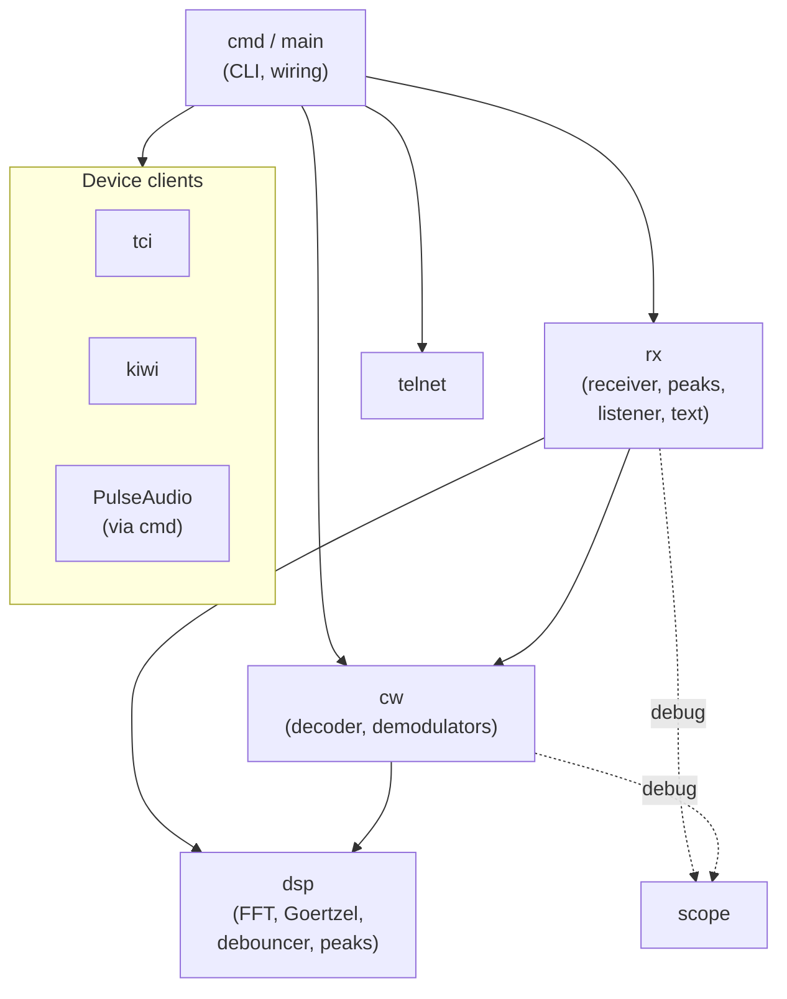
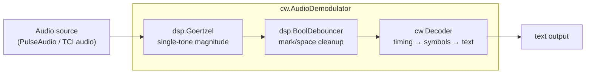
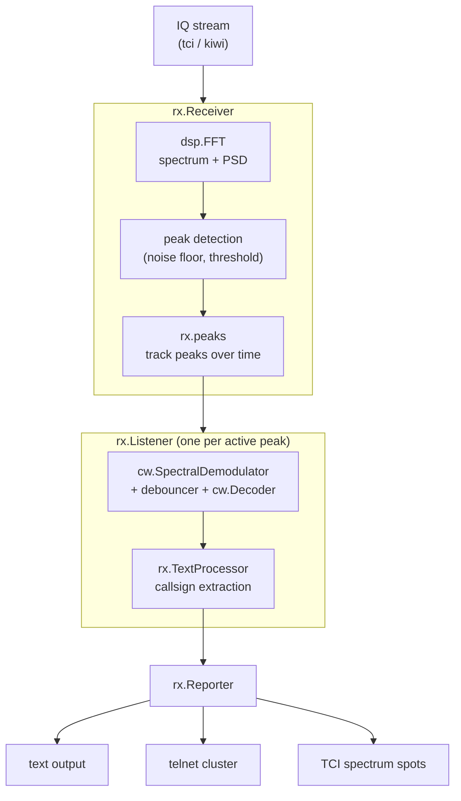

# Architecture Overview

> **Initial draft.** This maps the current code as a starting point for
> developing the architecture. It is high-level; per-package deep dives will
> follow. Details of the individual `cmd` sub-commands (`pulse`, `tci`, `kiwi`)
> have not yet been fully traced — those wiring points are marked below.

SDRainer is a single Go module (`github.com/ftl/sdrainer`, Go 1.26) built as one
CLI binary with sub-commands. It has two distinct signal paths that share a
common CW decoder:

- an **audio path** — decode a single CW tone from a PulseAudio (or TCI audio)
  source, and
- a **spectral / IQ path** — find *many* CW signals across an SDR's IQ spectrum,
  decode them, and spot the callsigns.

## Packages

| Package | Role |
| --- | --- |
| `main` + `cmd/` | CLI entry point and [Cobra](https://github.com/spf13/cobra) command tree: `decode` (`pulse`/`tci`), `strain` (`tci`), `kiwi`, `version`. Each sub-command wires a device source to the appropriate pipeline. |
| `cli/` | CLI helper utilities. |
| `dsp/` | Generic DSP primitives, parameterized over a numeric type (`Number`): `FFT` (spectrum + PSD), `Goertzel` single-tone detector, `BoolDebouncer`, filter-block helpers, peak types. The mathematical core, independent of CW or any device. |
| `cw/` | The CW decoder and its two front-ends. `Decoder` turns a debounced on/off (mark/space) signal into text (Goertzel-timing based, derived from OZ1JHM's Arduino decoder). `AudioDemodulator` drives it from an audio stream via a `Goertzel` filter; `SpectralDemodulator` drives it from a spectral magnitude representation. |
| `rx/` | The receiver pipeline for the IQ path: `Receiver` (IQ → FFT spectrum/PSD → peak detection), `peaks` (peak tracking over time with state), `Listener` (binds a `SpectralDemodulator` + `TextProcessor` to a tracked peak), `TextProcessor` (callsign extraction and spotting), and the `Reporter` output interface. |
| `tci/` | Client for the [TCI](https://github.com/ftl/tci) protocol — IQ stream in, VFO/spot control out (e.g. Expert Electronics SunSDR). |
| `kiwi/` | Client for KiwiSDR devices. |
| `scope/` | A gRPC "scope" server used for debugging: internal signals (`audio`, `demod`, `spectrum`, …) can be streamed out and visualized. Wired throughout `dsp`/`cw`/`rx` via a `scope.Scope` handle. |
| `telnet/` | A telnet server that presents spotted callsigns like a local DX cluster. |

## Dependency direction

`dsp` sits at the bottom (depends on nothing internal). `cw` builds on `dsp`.
`rx` builds on both. `cmd` wires devices, `rx`/`cw`, and the output sinks
(`telnet`, `scope`) together. `scope` is a cross-cutting debug concern.

## Audio path (`decode pulse` / `decode tci`)

Decodes a single CW tone at a fixed frequency (the receiver's audio passband).

`AudioDemodulator` (`cw/audio.go`) runs a `Goertzel` filter tuned to the tone
frequency to get a per-block magnitude, debounces it into a clean on/off
(mark/space) signal, and feeds that to the `Decoder`.

## Spectral / IQ path (`strain tci`)

Finds and decodes many CW signals across the whole IQ spectrum, then spots the
callsigns.

The `Receiver` (`rx/receiver.go`) transforms incoming IQ into a magnitude
spectrum and power spectral density via `dsp.FFT`, estimates a noise floor, and
detects peaks. Detected peaks are tracked over time (`rx/peaks.go`) with a state
machine and a timeout. Each sufficiently persistent peak gets a `Listener`
(`rx/listener.go`) that attaches a `SpectralDemodulator` (which slices the
peak's frequency bins, debounces, and runs the shared `cw.Decoder`) and a
`TextProcessor`. The `TextProcessor` (`rx/text_processor.go`) scans the decoded
text for callsigns (regex + `ftl/hamradio` callsign/DXCC/SCP lookups) and, once
a callsign is seen often enough (`spottingThreshold`), reports a spot through
the `Reporter` interface (`rx/rx.go`).

Listeners are a limited resource: `strain` cycles them across peaks using
`silence` and `busy` (attachment) timeouts, so idle or long-busy frequencies
release their listener for another peak.

## Output: the `Reporter` interface

`rx.Reporter` (`rx/rx.go`) decouples detection from output. Events:
`ListenerActivated` / `Deactivated`, `CallsignDecoded`, `CallsignSpotted`,
`SpotTimeout`. `TextReporter` prints them to a writer; the telnet server and TCI
spot control are the other intended sinks (wiring in `cmd/` — to be confirmed).

## Open questions / to trace

- Exact wiring inside `cmd/pulse.go`, `cmd/tci.go`, `cmd/kiwi.go` (how sources,
  receivers, listeners, telnet, and scope are assembled per command).
- How the `scope` server is enabled/consumed in practice.
- The concurrency model: which parts run in their own goroutines and how
  back-pressure / buffering (e.g. `iqBufferSize`, `cumulationSize`) behaves.
- Whether the audio path and spectral path can share more of their
  demodulator/decoder setup than they do today.
