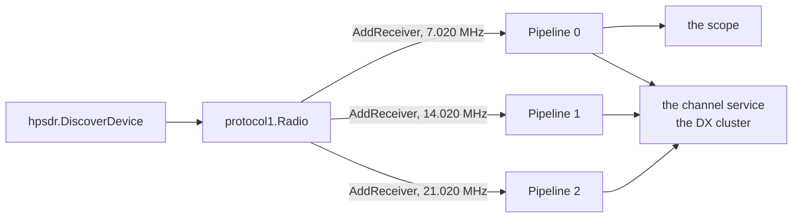

# Plan: the `hpsdr` command

> **Status on 2026-08-23: the steps 1 to 4 are implemented.** Section 8.3 of
> doc/architecture.md holds what the code does. Step 5, the test against real
> hardware, is open, and section 6 below holds two answers that the
> implementation gave.

```
sdrainer hpsdr --host=<host:port> --center=7020000,14020000,21020000 --sample-rate=48000
```

One receiver for each frequency of `--center`, each one with its own pipeline.
With more than one frequency the command behaves as `tci --all-trx` does.

## 1. What the protocol is

The sources, read on 2026-08-23:

| Source | What it gives |
|---|---|
| [USB_protocol_V1.60.doc](https://github.com/TAPR/OpenHPSDR-SVN/tree/master/Documentation) | the frame of 512 bytes, the command and control bytes, the layout of the samples |
| [Metis - How it works V1.33](https://github.com/TAPR/OpenHPSDR-Firmware/blob/master/Protocol%201/Documentation/Metis-%20How%20it%20works_V1.33.pdf) | the discovery, the start and the stop command, the UDP frame |
| [Hermes-Lite2 wiki](https://github.com/softerhardware/Hermes-Lite2/wiki/Protocol) | what the Hermes-Lite 2 adds to that protocol |

**Both devices of the task speak the same protocol.** The Hermes-Lite 2 speaks
openHPSDR protocol 1 with a few extensions, and the documents of TAPR describe
that same protocol 1. There is only one wire format to implement.

> **Protocol 2 is another protocol and it is not in this plan.** It uses other
> ports and one stream for each receiver. The task names the folder of TAPR that
> holds the documents of protocol 1, so protocol 2 stays open. A newer ANAN
> device in protocol 2 mode does not work with this command.

### 1.1 The frames

```
discovery   PC → 255.255.255.255:1024   <0xEFFE><0x02><60 x 0x00>
reply       device → PC                 <0xEFFE><status><MAC 6><version><board id><49 x 0x00>
start/stop  PC → device:1024            <0xEFFE><0x04><command><60 x 0x00>
data        device → PC                 <0xEFFE><0x01><0x06><sequence 4><2 x 512 byte frame>
control     PC → device:1024            <0xEFFE><0x01><0x02><sequence 4><2 x 512 byte frame>
```

One frame of 512 bytes:

```
<0x7F><0x7F><0x7F><C0><C1><C2><C3><C4> then 504 bytes of samples
```

With `n` receivers one group of samples is `6n + 2` bytes: 3 bytes of I and 3
bytes of Q for each receiver, and 2 bytes of the microphone. The rest of the
frame is 0.

| Receivers | Bytes for one group | Groups in one frame |
|---|---|---|
| 1 | 8 | 63 |
| 2 | 14 | 36 |
| 3 | 20 | 25 |

**A sample of I and of Q is 24 bit, signed, the most significant byte first.**

### 1.2 The control

`C0` holds an address, and `C1` to `C4` hold a word of 32 bit. The PC sends the
addresses one after the other, round robin.

| Address | What it holds |
|---|---|
| 0x00 | the sample rate in `C1[1:0]`, the count of the receivers in `C4[5:3]` |
| 0x01 | the frequency of the transmitter |
| 0x02 | the frequency of receiver 1 |
| 0x03 … | the frequency of receiver 2 and of each receiver after it |

The sample rate is 48, 96, 192 or 384 kHz, and it holds for **each** receiver of
the device. Each receiver has its own frequency.

**This is what the task needs**: three receivers on three bands, one sample rate.
Each receiver of a device sees the same antenna and the same ADC, and an HF
device covers 0 to 30 MHz, so 7, 14 and 21 MHz at the same time need no second
receiver hardware.

### 1.3 What the Hermes-Lite 2 changes

- The board id of the discovery reply is 0x06.
- The count of the receivers uses 4 bits, `C4[6:3]`, so up to 12 receivers. The
  original protocol uses 3 bits, `C4[5:3]`, so up to 8. **The two agree for 8
  receivers and less**, because the lower 3 bits are the same.
- It has more addresses for its own values, and this command needs none of them.

## 2. The decision: a library and not our own client

**[github.com/jancona/hpsdr](https://github.com/jancona/hpsdr) does this work
already.** It is a Go library for protocol 1, and it holds 1250 lines.

| What it gives | Why it fits |
|---|---|
| `DiscoverDevice`, `DiscoverDevices` | the discovery of section 1.1 |
| `protocol1.NewRadio(device)` | the session, the sequence numbers, the round robin of the C&C |
| `radio.SetSampleRate(48000)` | 48, 96, 192 and 384 kHz |
| `radio.AddReceiver(func([]ReceiveSample))` | **one callback for each receiver** |
| `receiver.SetFrequency(hz)` | the frequency of one receiver |
| `radio.Start()`, `Stop()`, `Close()` | the start and the stop command |

It knows Metis, Hermes, Angelia, Orion, Orion2, Hermes-Lite, Hermes-Lite 2, the
PiSDR and the Red Pitaya, with the count of the receivers of each one. It
therefore covers the original device and the Hermes-Lite 2, which is what the
task asks for.

Two details that we checked in its source:

- `samplesPerMessage := (512 - 8) / (len(receivers)*6 + 2)` is the layout of
  section 1.1.
- The count of the receivers goes into the word as `count << 3`, with 4 bits.
  That is the way of the Hermes-Lite 2, and it is the same as the original way
  for 8 receivers and less.

**It transmits nothing**, and SDRainer transmits nothing.

> **The licence is Apache 2.0**, and SDRainer is MIT. Apache 2.0 permits the use
> in an MIT project, and it asks that the NOTICE file of the library goes with a
> distribution. That is a note in our own NOTICE or in the README.

> **The risk: one maintainer, and the last commit is of January 2024.** The
> library is small, and the protocol is from 2013 and does not move. If the
> library stops, a fork of 1250 lines is a day of work. Writing our own client
> now is three days for the same result.

## 3. The structure



The new package `hpsdr` holds `Process`, as `tci` and `kiwi` hold their source.

| File | What it holds |
|---|---|
| `hpsdr/hpsdr.go` | `Process`: the discovery, the radio, one pipeline for each receiver |
| `hpsdr/samples.go` | the samples of one receiver into the interleaved `[]float32` of `Pipeline.IQData` |
| `cmd/hpsdr.go` | the flags |

### 3.1 The rules of more than one receiver are already there

`tci --all-trx` holds them, and each one holds here too:

| Rule | Why |
|---|---|
| the id of a channel carries the number of the receiver | each pipeline counts its channels from 1 |
| only the first receiver writes to the scope | the scope shows one spectrum |
| only the first receiver goes into `--record` | two IQ streams in one file are not two streams |
| the channel service and the spotter take each receiver | that is the purpose of more than one receiver |

**They stand in `tci` today, in `trxListener` and in `newPipeline`.** The second
source that needs them is the moment to move them: a new package `multirx` (or a
type in `core`) holds the listener that puts the number in front of the id, and
`tci` and `hpsdr` both use it. That is approximately 80 lines that move, and the
tests of `tci/alltrx_test.go` move with them.

> **The alternative is a copy of those 80 lines in `hpsdr`.** A copy of a rule
> that a measurement gave is a copy that goes out of date. We move it.

### 3.2 The samples

The library gives `[]ReceiveSample` for each receiver, and one sample holds the
6 bytes of I and Q and the 2 bytes of the microphone. `IFloat()` and `QFloat()`
give the two values as a `float32` between −1 and 1.

`Pipeline.IQData` takes one slice of interleaved I and Q, so the conversion is a
loop over the samples of one callback. The buffer belongs to the process and it
holds for one call, as the buffer of `tci` does.

**One goroutine for each receiver.** `Pipeline.IQData` is not safe for two
callers at the same time, and the library calls the callback of each receiver
from its own reader. The plan therefore gives each pipeline the samples of its
own receiver only, and the callback of one receiver never runs twice at the same
time. **We must check that in the library**, see section 6.

## 4. The flags

```
sdrainer hpsdr --host=<host:port> --center=<hz>[,<hz>...] --sample-rate=48000 [--threshold=<dB>]
```

| Flag | Default | What it does |
|---|---|---|
| `--host` | — | the address of the device. Without a port it is 1024. Empty gives a discovery on the local network, and the first device that answers. |
| `--center` | — | one frequency for each receiver, separated by a comma |
| `--sample-rate` | 48000 | 48000, 96000 or 192000 |
| `--threshold` | 10 | as with each other source |

**384 kHz is not in the list.** The device gives it, and SDRainer never ran at
that rate: `supportedSampleRates` of the tests holds 12 to 192 kHz. The rate
would work, and nothing measured it. A later step can add it with a measurement.

**The count of the receivers has a limit**, and the device names it: the
discovery gives `SupportedReceivers`. The command must say that clearly when
`--center` holds more frequencies than the device has receivers, and it must not
start.

## 5. The steps

| Step | What | Test |
|---|---|---|
| 1 | `multirx`: the listener with the number of the receiver moves out of `tci` | the tests of `tci/alltrx_test.go` move with it and stay green |
| 2 | `hpsdr/samples.go`: `[]ReceiveSample` to interleaved `[]float32` | a table test with the bytes of section 1.1, and one with a sample of a known value |
| 3 | `hpsdr/hpsdr.go`: `Process` with the discovery, the radio and one pipeline for each frequency | a fake radio, see below |
| 4 | `cmd/hpsdr.go`: the flags, the list of the frequencies, the limit of the device | — |
| 5 | a test against real hardware | manual, see section 6 |
| 6 | the documents | a section in doc/architecture.md |

**The fake radio of step 3.** The library takes a `*hpsdr.Device` and it opens a
UDP connection itself, so a test needs either a UDP server that speaks the
protocol, or an interface of our own in front of the library. The second way is
smaller: `Process` takes a small interface with `AddReceiver`, `SetSampleRate`,
`Start` and `Stop`, and the test gives it a fake. The protocol itself then has no
test of ours, which is right: it is the work of the library.

## 6. What we must check before the implementation

- **The concurrency of the callbacks: answered.** `receiveSamples` of the library
  is one goroutine, and it calls the callback of each receiver one after the
  other, under its own lock. `Pipeline.IQData` needs exactly that, and each
  receiver therefore needs one buffer and no lock.

  The other side of it: **a pipeline that waits holds each other receiver back.**
  The samples of every receiver come from that one goroutine, so a pipeline whose
  buffer of frames is full stops the reader of the device. The buffer holds 32
  frames and the pipeline runs many times faster than real time, so that is no
  problem today, and a measurement must say it if it becomes one.

- **A defect of the library, found while we read it.** `receiveSamples` gives the
  samples of a frame to each receiver, and `decodeSamples` gives `nil` back when
  the sync bytes of that frame are wrong or when the ACK bit is set. The caller
  writes the error into the log and it then reads `s[n]` of that `nil`, which
  **panics and ends the program**. A frame with a wrong sync needs a lost or a
  changed UDP packet, and that is rare on a LAN and not impossible.

  The same code gives the samples of the first frame a second time when a packet
  holds only one frame.

  Neither of the two is in our reach: the panic happens in a goroutine of the
  library. The answer is a report to the maintainer, and, if that leads nowhere,
  the fork that section 2 already names.
- **The cadence of the control frames: answered, and it was a defect.** The
  library sends **no** frame on EP2 after the start, and its `Start` sends only
  four: the sample rate, the count of the receivers, the frequency of the
  transmitter and the frequency of the **first** receiver.

  A test with a Hermes-Lite 2 showed the first half of the cost: the device sent
  its samples for approximately 10 s and then no more, because its watchdog needs
  a packet of the PC. The second half was still hidden behind it: the addresses
  of the command and control bytes go out one with each packet, so the second
  receiver and each one after it never got a frequency.

  The process now sends an empty stream itself, approximately 380 packets for
  each second, as the application of the library does. The comment of that
  application names both reasons: "Send empty transmit samples to pass config
  changes and keep watchdog timer happy".
- **The sample rate of 384 kHz**, see section 4.
- **The order of I and Q: answered by a measurement, and it was a defect.** The
  device gives the field that the protocol calls Q as the real part of the
  sample. The first implementation took the two in the order of their names, and
  the spectrum was mirrored about the center: a station 10.5 kHz above the center
  stood 10.5 kHz below it. Section 8.3 of doc/architecture.md holds the
  measurement.

  **No test of SDRainer can find this.** A test makes its samples with the same
  assumption that the code reads them with.

- **Hardware.** We have no device. Steps 1 to 4 are testable without one, and the
  claim "it works with a Hermes-Lite 2 and with an original device" needs a test
  with each of the two.

## 7. What this gives

An `hpsdr` command that runs three receivers on three bands with one device,
each with its own pipeline, and each spot on one DX cluster. That is the first
source of SDRainer that watches more than one band at the same time with one
piece of hardware, and it needs no change of the pipeline.
