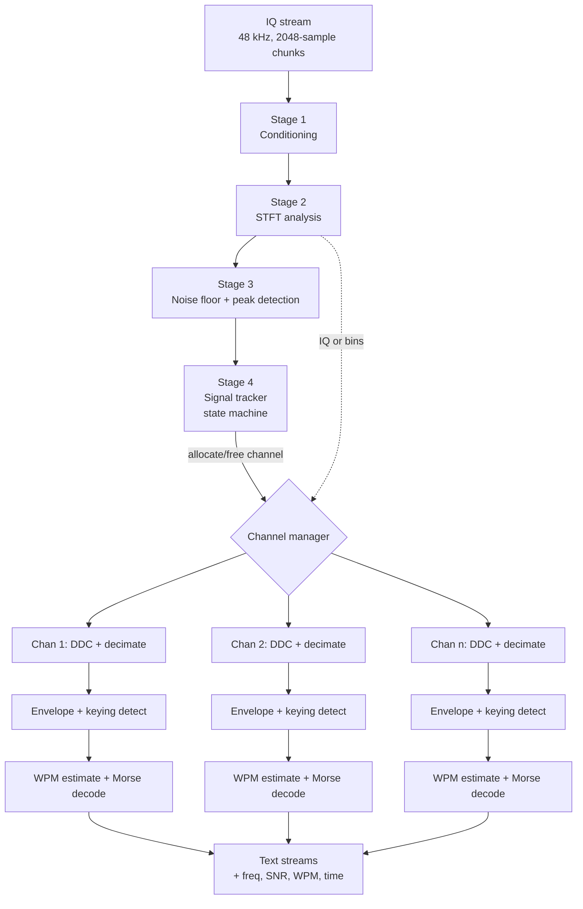
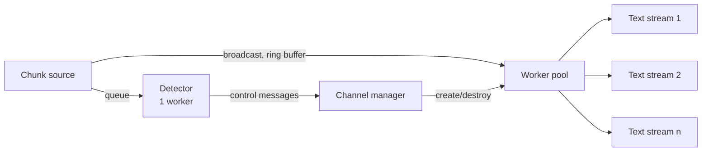

# Research: CW Multi-Signal Decode Pipeline

> **Scope.** This document describes a general, language-agnostic processing
> pipeline that takes a continuous IQ sample stream and produces one decoded
> text stream for each CW signal it finds. It is a design overview and a
> theoretical reference, **not** a description of the current SDRainer
> implementation. Where SDRainer differs, the difference is not marked here yet.
> Compare against [The Architecture of SDRainer](./architecture.md) before you
> use this document to justify a code change: that document describes the code
> of today, and this one describes the theory.

Assumed input for all numbers in this document:

- complex samples (I and Q), `float32`
- sample rate 48000 Hz
- chunks of 2048 IQ samples, so one chunk each 42.667 ms, 23.4375 chunks each
  second

## 1. Overview

Two tiers. The **detection tier** runs one time. It is wideband and slow. The
**decode tier** runs one time for each signal. It is narrowband and fast.

## 2. Stage 1 — Conditioning

Remove the DC offset from I and Q. Use a one-pole high-pass filter, corner near
20 Hz.

Correct the IQ gain and phase imbalance if the receiver needs it. An imbalance
makes a mirror image of each signal at the negative frequency. The image looks
like a real signal to the detector.

This stage is optional. Skip it if the front end is good.

## 3. Stage 2 — STFT analysis

Keep a sliding buffer. Push each 2048-sample chunk into the buffer. Take one FFT
for each hop, not for each chunk.

Apply a Hann window before each FFT. The window stops spectral leakage. Key
clicks leak into many bins without a window.

Recommended values:

| Parameter | Value | Result |
|---|---|---|
| FFT size | 4096 | 11.7 Hz for each bin |
| Window time | 85.3 ms | good frequency resolution |
| Hop | 1024 samples | one frame each 21.3 ms |
| Overlap | 75 % | smooth in time |

The long window is correct **for detection only**. It integrates energy and
finds weak carriers. It also smears the keying, because a dot at 30 WPM is
40 ms. This does not matter here. The decode tier gets the time resolution.

Output: a magnitude-squared spectrum for each frame.

## 4. Stage 3 — Detection

### 4.1 Noise floor

Estimate the noise floor for each bin. Use a moving median across the frequency
axis, over a span of approximately 500 Hz. A median ignores the signal peaks
inside the span.

Smooth the floor in time with an exponential filter. Use a time constant of 1 s
to 5 s.

### 4.2 Peak selection

Mark a bin as a candidate if its power is more than 6 dB to 10 dB above the
local floor.

Group adjacent candidate bins. One CW signal covers 3 to 10 bins, because of the
keying sidebands. Find the center frequency with parabolic interpolation on the
peak bin and its two neighbours. This gives an accuracy better than 2 Hz.

Merge groups that are less than 40 Hz apart. They are one station.

### 4.3 CW discrimination

A peak is not always a CW signal. Beacons, carriers, data modes and receiver
birdies also make peaks.

Test the keying modulation. Take the magnitude history of the peak bin over 1 s
to 2 s. A CW signal switches between two levels at 5 Hz to 25 Hz. Calculate one
of these:

- the variance of the envelope, normalized by its mean
- the bimodality of the envelope histogram (two clear clusters)
- the autocorrelation of the envelope (a peak at the dot period)

Reject a peak with a constant envelope. Reject a peak with a random envelope.

This test removes most false channels. It is the most valuable single filter in
the pipeline.

#### What the implementation does

`TrackerStage.isCW` in [pipeline/tracker_stage.go](../pipeline/tracker_stage.go)
uses two of these measures, and a candidate must pass both. The envelope is not
the magnitude history of the bin, but one bit for each frame: the detection
stage found a peak, or it did not. The tracker keeps these bits in a ring over
the CW window.

**The duty cycle** is the part of the frames with a peak. `MaxDutyCycle` is 0.9.

**The autocorrelation** is not a peak at the dot period, as this section
proposes, but the *smallest* value over the lags from 1 to `MinKeyingRate`. A
search for a peak needs a clean period, and CW has none: the length of the
symbols, of the characters and of the words is different. The smallest value
needs no period. An envelope that switches faster than the lag range comes out
of phase with itself somewhere in the range, thus the value goes to 0 or below.
An envelope that switches slower stays high at every lag.

The measurement with the scene of the `test` command gives these values. The
frames are 21.3 ms and the lag range is 200 ms, thus 9 frames.

| signal | duty cycle | smallest autocorrelation |
|---|---|---|
| CW, 6 WPM to 35 WPM | 0.70 to 0.87 | 0.09 and below |
| a carrier | 1.00 | 1.00 |
| a carrier that switches with 0.25 Hz | 0.50 | 0.79 |
| a carrier that switches with 0.5 Hz | 0.50 | 0.62 |
| a signal that switches with 1 Hz | 0.50 | 0.22 |

The limits are `MaxDutyCycle` 0.9 and `MaxAutocorrelation` 0.4.

Two results are important:

- **The duty cycle of real CW is 0.70 to 0.87, and not the 0.4 of an ideal
  square.** The window of the STFT is 85 ms and thus longer than one dit, so it
  smears the gaps of the keying. This is the same limit as in
  section 3.1 of [The Architecture of SDRainer](./architecture.md). The limit
  for the duty cycle must therefore stay generous. A low limit removes real CW.
- **Each measure alone is not sufficient.** A carrier that switches slowly has
  the duty cycle of CW, and only the autocorrelation removes it. A carrier
  without gaps has no change in its envelope, and its autocorrelation is 1 at
  every lag, but the duty cycle removes it first.

**The border of the test.** A signal that switches with 1 Hz passes.
`MinKeyingRate` is 2.5 Hz and not the 5 Hz of this section, because a slow
operator sends slower than 5 Hz. A rate of 1 Hz gives elements of 0.5 s, which
an operator can also key by hand, so the tracker must not remove it.

`TestTrackerUsesTheDutyCycleAndTheAutocorrelation` in
[pipeline/tracker_stage_test.go](../pipeline/tracker_stage_test.go) shows that
each measure removes a signal that the other measure accepts.

## 5. Stage 4 — Signal tracker

A CW signal is not continuous. It stops between characters, between words and
between transmissions. A detector without memory makes and destroys channels
many times each second.

Use a state machine for each tracked frequency:

| State | Entry condition | Action |
|---|---|---|
| `NEW` | first detection | start a counter |
| `CONFIRMED` | detected in N frames inside a window, and the CW test passes | allocate a decode channel |
| `ACTIVE` | energy present | feed the decoder |
| `IDLE` | no energy for more than 1 s | keep the channel and the WPM estimate |
| `DEAD` | no energy for more than 10 s to 30 s | free the channel, close the text stream |

The `IDLE` hold time must be longer than a word space. A word space is 7 dot
lengths, approximately 300 ms at 25 WPM. Make the hold time large, because
operators pause.

Track the frequency slowly. Move the tracked center to the measured peak with a
small step, for example a maximum of 1 Hz for each second. This follows the
transmitter drift. It does not follow the noise.

## 6. Stage 5 — Per-signal extraction

For each `CONFIRMED` signal, make a narrow baseband channel.

### Option A — Digital downconversion (recommended)

1. Multiply the IQ stream by a complex exponential at the negative of the signal
   frequency. This moves the signal to 0 Hz.
2. Low-pass filter. Use a bandwidth of 100 Hz to 200 Hz. A 200 Hz filter is
   tolerant of drift and of hard keying. A 100 Hz filter gives approximately
   3 dB more sensitivity.
3. Decimate to 500 Hz or 1000 Hz. The decimation makes all later work cheap.

Use a cascade for the decimation. A CIC or half-band chain from 48 kHz to 1 kHz
costs much less than one long FIR filter.

This option gives full time resolution and clean control of the noise bandwidth.

### Option B — Reuse the STFT bins (cheap)

Take the magnitude of the peak bin, or the sum of the 3 center bins, for each
frame. This is the envelope. It is free, because Stage 2 calculated it.

The limit is the frame rate and the window time. With a 4096 FFT you get 21.3 ms
samples and a smeared envelope. This works below 25 WPM. It fails above.

To use Option B for fast CW, add a second short STFT: FFT 1024, hop 256. This
gives 46.9 Hz bins and 5.33 ms frames. The frequency resolution is enough,
because the tracker already knows the frequency.

Choose Option A if the signal count is small. Choose Option B, or a polyphase
channelizer, if the signal count is large.

## 7. Stage 6 — Envelope and keying detection

1. Calculate the magnitude of the complex baseband samples. Use `|I| + |Q|` if
   speed matters more than accuracy.
2. Low-pass the magnitude at 40 Hz to 60 Hz. This removes the noise but keeps
   the keying edges.
3. Find the two levels. Track a slow maximum (the mark level) and a slow minimum
   (the space level). Use asymmetric decay: fast attack, slow release.
4. Set the threshold between the two levels, for example at 50 %. Add hysteresis
   of 10 % to 20 % (a Schmitt trigger). Hysteresis stops chatter on a weak
   signal.
5. Reject each mark and each space that is shorter than a minimum time, for
   example 8 ms. These are noise spikes and key clicks.

Output: a sequence of events. Each event has a state (mark or space) and a
duration.

Report the SNR here. The ratio of the mark level to the space level is a good
quality measure. Give it to the consumer with the text.

## 8. Stage 7 — Timing estimate

The dot length is not known and it changes. Calculate it from the data.

Dot length in milliseconds = 1200 / WPM. At 20 WPM the dot is 60 ms. At 40 WPM
it is 30 ms.

Method: collect the mark durations in a histogram or in a short list. The
durations make two clusters. The lower cluster is the dot. The upper cluster is
the dash, near 3 times the dot. Use a simple 2-means split, or take the 20th
percentile of the mark durations as the dot estimate.

Update the estimate continuously with an exponential filter. Hand-sent Morse is
not exact. The dash-to-dot ratio can be 2.5 or 4.0. The word space is often too
long.

Use ratio thresholds, not absolute times:

| Measurement | Rule |
|---|---|
| mark < 2 × dot | dot |
| mark ≥ 2 × dot | dash |
| space < 2 × dot | inside a character |
| 2 × dot ≤ space < 5 × dot | character end |
| space ≥ 5 × dot | word end |

Lock the estimate when it is stable. Do not let one long dash destroy it.

## 9. Stage 8 — Morse decode

Collect the dots and the dashes into a symbol buffer. On a character end, look
up the buffer in the Morse table. Emit the character.

Use a binary tree, or a string key in a map. Both are trivial. A tree needs no
string operations.

On a word end, emit a space.

Emit `?` or nothing for an unknown symbol sequence. Do not stop. A wrong
character must not break the stream.

Handle the prosigns as multi-character output, for example `<BK>`, `<AR>`,
`<SK>`.

Flush the buffer on a long silence.

## 10. Output

One text stream for each decode channel. Attach metadata to each stream, and
update it:

- channel ID (stable while the signal lives)
- center frequency in Hz, and the drift
- SNR in dB
- WPM
- timestamp of each character
- state (`ACTIVE`, `IDLE`)

The channel ID must not be the frequency. The frequency changes with drift. Use
a counter.

## 11. Parallel structure

Rules:

- The detector is one worker. It is cheap, because one FFT for each 21.3 ms is
  small work.
- Each channel is independent after Stage 5. Put the channels in a worker pool.
- One worker at a time for each channel. The samples must stay in order.
- Give each channel a bounded input queue. If a decoder falls behind, drop the
  oldest samples and mark a gap in the text. Do not block the input.
- Share the IQ samples with a ring buffer, not with copies. All channels read
  the same chunk.
- Size the pool by CPU count, not by signal count. The signal count changes
  fast.

Cost estimate: after decimation to 1 kHz, one channel needs approximately 10⁴
operations for each second. A CPU core runs hundreds of channels. The decimation
filter in Stage 5 is the real cost. It runs at 48 kHz. Use the cascade.

## 12. Pitfalls

- **Two stations on the same frequency.** Signals closer than the channel
  bandwidth cannot be separated. The decoder makes nonsense. Detect this with a
  bad character rate, or with three envelope levels instead of two. Mark the
  stream as unreliable.
- **Key clicks.** A strong local station with hard keying makes peaks over many
  kHz. Reject a candidate if its envelope is the same as a stronger neighbour's
  envelope.
- **The mirror image.** An IQ imbalance makes a false signal at `-f`. Compare
  the two envelopes. Reject the weaker one.
- **Latency.** The chunk gives 42.7 ms. The character end needs a space of 3
  dots, approximately 120 ms. The total latency is approximately 200 ms to
  300 ms. This is normal for a CW skimmer.
- **AGC interaction.** A receiver AGC changes all levels together when a strong
  signal appears. This moves the mark and space levels in every channel. Use
  per-channel adaptive levels, not one global level.
- **Fading.** On HF the signal level changes inside one transmission. The
  adaptive threshold must be faster than the fade. Use an attack of
  approximately 50 ms and a release of approximately 500 ms.

## 13. Validation

Test each stage with a generator, not with live signals:

1. Make a synthetic IQ stream. Put 5 CW signals at known frequencies, with known
   WPM and known text.
2. Add white noise at a controlled SNR.
3. Compare the output text with the input text. Measure the character error rate
   against the SNR.
4. Add drift, fading and key clicks one at a time.

A working decoder gets 0 errors at 10 dB SNR in 500 Hz. Below 0 dB SNR the
errors grow fast. This curve is the only honest measure of the pipeline.
