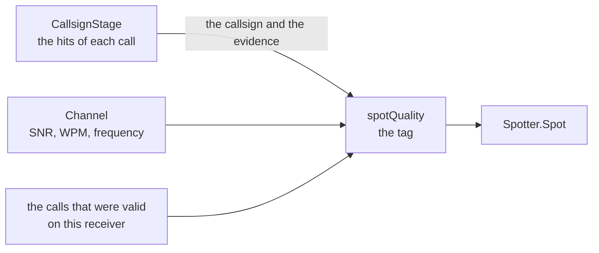

# Concept: the quality tag of a spot

> **Status: implemented on 2026-08-23**, with the meaning of `V` of section 4.1
> and `validCallsignHits` = 4. Section 6 is open: no measurement stands behind
> that value yet. Section 9 of doc/architecture.md holds what the code does.

A skimmer makes wrong spots. A busted callsign costs a contest operator a QSO
and a penalty, so the consumer of a spot wants to know how much it can trust it.
The CT1BOH algorithm of AR-Cluster 6 gives that answer with one character, and
several logging programs already read it.

This document holds what the sources say, and how SDRainer can give that answer
for itself.

## 1. What the sources say

The sources, read on 2026-08-23:

| Source | What it gives |
|---|---|
| [DXLog, Additional Information](https://dxlog.net/docs/index.php/Additional_Information#Special_support_for_AR_Cluster_6) | the command, the tags, and what a logger makes of them |
| [N1MM+, The Telnet Window](https://n1mmwp.hamdocs.com/manual-windows/telnet-window/) | the tags and the position of the tag in the line |
| [Reverse Beacon, Testing Spot Quality Filters](http://reversebeacon.blogspot.com/2013/08/testing-spot-quality-filters.html) | the definition of each tag, and the weakness of the algorithm |
| [AR-Cluster V6 manual, N5PA](https://www.n5pa.com/ham.arcluster.php) | the terms of the filter |

The two articles of the CQ-Contest reflector that the task names
([1](https://lists.contesting.com/_cq-contest/2013-11/msg00085.html),
[2](https://lists.contesting.com/archives/html/CQ-Contest/2013-07/msg00138.html))
are behind a bot protection and we could not read them. The four sources above
hold the same algorithm, and section 6 says which detail is therefore not
certain.

### 1.1 The five tags

| Tag | Name | The rule of AR-Cluster 6 |
|---|---|---|
| `?` | not yet verified | the first or the second spot of a station on a frequency |
| `V` | valid | at least three skimmers worldwide posted the same call on the same frequency |
| `Q` | QSY? | a station that was verified appears on a new frequency, with the first or the second spot there |
| `B` | busted | the call is near a call that is already valid, by the Levenshtein distance, and the correct call stands in parentheses |
| `.` | unique | only one or two skimmers spot stations in that country at the moment |

**The client asks for the tags.** `SET DX EXTENSION SKIMMERQUALITY` switches them
on, and the setting lasts over a login. The tag then stands **at the right end of
the comment field**.

A skimmer spot of AR-Cluster 6 looks like this, and the tag comes behind it:

```
DX de K1TTT-#:    7000.7  NP2X          CW 35 dB 26 WPM CQ            2144Z
```

The `-#` behind the callsign of the spotter says that a skimmer made the spot.
SDRainer already writes it: the default of `--cluster-call` is `local-#`.

### 1.2 What a logger makes of them

DXLog holds three values, and it maps the five tags onto them:

| DXLog | From |
|---|---|
| `?` | unreliable |
| `P` | fairly reliable: a `Q`, or a `B` with a corrected call |
| `V` | validated |

**A busted spot without a corrected call goes away.** A `B` with a call in
parentheses becomes a spot of the corrected call.

### 1.3 The terms of the filter

AR-Cluster 6 lets a client filter on the tags and on other values of a skimmer
spot:

| Term | What it selects |
|---|---|
| `SKIMVALID`, `SKIMBUSTED`, `SKIMQSY`, `SKIMUNKNOWN` | the four tags |
| `SKIMCQ` | the comment holds `CQ` |
| `SKIMDUP` | the same spot again, over a window of 10 minutes |
| `SKIMDB` | the SNR, for example `SkimDb > 10` |
| `SKIMWPM` | the speed, for example `SkimWpm > 35` |

**SDRainer already knows each of these values.** The SNR and the speed stand in
`core.Channel`, and the callsign stage finds the callsign of a station because it
calls CQ.

## 2. The problem: SDRainer is one skimmer

**The CT1BOH algorithm is an algorithm of a network.** `V` means that three
skimmers **at different places** posted the same call on the same frequency, and
`B` means that the call is near a call that other skimmers made valid. A cluster
that collects from many skimmers can do that. One skimmer cannot.

SDRainer is one receiver at one place. It cannot say that three skimmers agree.

**It knows something else instead, and no aggregator has it:** the evidence
inside its own channel. A cluster sees one line of text for one spot. SDRainer
sees the whole transmission that made the spot.

## 3. What SDRainer already knows about a spot

Each value below exists today, and section 5 says where.

| The evidence | Where it comes from | What it says |
|---|---|---|
| the count of the hits | `callsignDetector.hits` | how often the station put its call beside a keyword |
| the distance to the second callsign | `callsignDetector.hits` | if another call of the same channel is nearly as strong |
| a correction | `CallsignStage.Process` reports again when it finds a better call | the first answer was wrong |
| the SNR | `core.Channel.SNR` | the copy of a weak signal holds more errors |
| the speed | `core.Channel.WPM` | a speed at the edge of the range says that the decode is unsure |
| the time of the channel | the tracker | a station that runs for a long time gave more evidence |
| the state of the channel | `core.Channel.State` | `ACTIVE` or `IDLE` |

**The count of the hits is the strongest of them.** `minCallsignHits` is 2
today, and the callsign stage reports nothing below it. A call with 2 hits and a
call with 12 hits are both a spot now, and they are not equally sure.

## 4. The concept

### 4.1 The rule

SDRainer keeps the vocabulary of the tags, so that a client that already filters
on them needs no change, and it computes each tag from its own evidence:

| Tag | The rule of SDRainer |
|---|---|
| `?` | the call reached `minCallsignHits` and no more, thus 2 hits |
| `V` | the call reached `validCallsignHits` hits, and no other call of the channel is near it |
| `Q` | the same call appears on a frequency of the **same band** that is far from the frequency that held it before, and the evidence of the new frequency is still thin |
| `B` | the call is near a call that this channel already made valid, by the Levenshtein distance, and the valid call stands in parentheses |

`.` has no meaning for one skimmer, and SDRainer does not use it.

**`Q` needs the band.** A station of a multi-operator group runs on more than one
band at the same time. Without the band each change between the two bands gives a
`Q`, and neither of the two frequencies ever becomes valid again. The band is the
count of the whole MHz, because no two bands of the amateur service hold the same
whole MHz.

**`B` needs a Levenshtein distance, and not the one of the transcription
harness.** `bestMatchDistance` of the tests looks for the best **part** of the
second text, so `DL1AB` stands at the distance 0 of `DL1ABC`. Two callsigns need
the distance of the whole text, otherwise each callsign that is a part of another
one is an error of the decoder. `levenshtein` in `pipeline/quality.go` is that
measure, and a test holds the difference between the two.

> **The semantics of `V` are not the semantics of AR-Cluster 6, and the document
> must say so.** There, `V` means that three receivers at three places agree.
> Here it means that one receiver heard the same call many times, over more than
> one transmission. Both are agreement over independent observations, and one is
> over the place while the other is over the time. A consumer that filters
> `SKIMVALID` gets a spot that SDRainer trusts, and not a spot that the network
> confirmed.
>
> **This is the decision to take before the implementation.** The other way is a
> tag of our own, for example `S` for "one skimmer is sure", which no logger
> reads. Then the feature helps nobody until a logger adds it.

### 4.2 The line

The comment of a spot follows the form of a skimmer spot, and the tag stands at
its right end:

```
today:    CW 24 WPM 25 dB
proposed: CW 25 dB 24 WPM CQ V
```

Three changes, and each one makes the line more like the line of AR-Cluster 6:

- **the dB before the WPM**, as each skimmer writes it,
- **`CQ`**, because the callsign stage finds a call of a running station and
  nothing else, so `SKIMCQ` becomes true for each spot of SDRainer,
- **the tag at the end**.

`B` also holds the corrected call: `CW 25 dB 24 WPM CQ B (DL1ABC)`.

**The implementation writes the tag always, and it has no flag.** A logger takes
the comment as free text, and the tag stands at its right end, so a client that
does not know the tags reads what it read before and one character more. A flag
is one line for each source when it becomes necessary.

## 5. The implementation



| Step | Where | What |
|---|---|---|
| 1 | `pipeline/callsign_stage.go` | `CallsignStage` gives the count of the hits of the leader and of the second call. It holds both today, and it reports neither. |
| 2 | `core` or `dsp` | `Levenshtein` moves out of the test of the transcriptions, with its test. |
| 3 | new, `pipeline/quality.go` | `spotQuality` takes the evidence and gives the tag and the corrected call. It holds the calls that this receiver made valid, so that `B` and `Q` have something to compare with. |
| 4 | `pipeline/pipeline.go` | `spotMessage` takes the tag and writes the form of section 4.2. |
| 5 | `cmd/root.go` | the flag `--spot-quality`. |

**The tag also stands in `core.Channel`**, and a change of it gives the event
`ChannelQualityChanged`. The DX cluster needs no change, because the tag stands
in the comment of the spot. The gRPC service holds the value as a string, and it
is empty while a channel gave no callsign.

**The size:** step 1 is approximately 20 lines, step 2 is a move, step 3 is
approximately 120 lines with its tests, step 4 is 10 lines.

## 6. What must be measured before it is on by default

**The tags are a claim about the truth, and a wrong claim is worse than no
claim.** A consumer that filters `SKIMVALID` and then works a busted call loses a
QSO, and it loses it because we said `V`.

The recordings in `pipeline/testdata` give the measurement. Each one holds the
text that a human wrote, so the correct callsign of each station is known:

1. Run each recording and collect each spot with its tag and its hits.
2. For each spot, compare the call against the transcription of that channel.
3. The result is a table: for each tag, how many spots were right and how many
   were wrong.

`validCallsignHits` comes from that table: the smallest count at which no spot
of the recordings is wrong, with a margin.

**Today the data is thin.** The three recordings give few spots, and one of them
gives none at all. The measurement therefore needs more recordings with
transcriptions, and `sdrainer prepare` makes that work short.

## 7. What is not certain

- **The exact column of the tag.** Both loggers say "at the right end of the
  comment field", and no source gives a byte position. The comment field of
  SDRainer is 31 characters wide, and a tag at the end of the text inside that
  field follows the description.
- **The parentheses of the corrected call.** The sources say that the correct
  call stands in parentheses, and none of them shows a complete line with a `B`
  and a correction.
- **The exact rules of AR-Cluster 6**: the time window of the agreement, the
  limit of the Levenshtein distance, and the rule of `.` are not in the sources
  that we could read.
- **Whether a logger accepts a `V` from a single skimmer.** We know that DXLog
  and N1MM+ read the tag. We did not test what they do with a spot of SDRainer.
